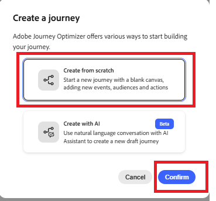

# Crea Percorso

In questo passaggio verrà creato un percorso in Adobe Journey Optimizer attivato dall&#39;evento price.drop personalizzato. Quando questo evento viene ricevuto, il percorso viene avviato in tempo reale e invia una notifica push agli utenti che hanno acconsentito, abilitando il coinvolgimento guidato dagli eventi.

Per creare un percorso che viene attivato all&#39;evento price.drop, attieniti alla seguente procedura

* Accedi a Journey Optimizer
* Passa a Gestione Percorsi | Percorsi | Crea Percorso

## Aggiungi PriceDropEvent

Trascina `PriceDropEvent` dalla sezione eventi all&#39;area di lavoro

## Aggiungi azione push

Espandi la sezione Azioni. Trascina e rilascia l&#39;attività `Action` nell&#39;area di lavoro e seleziona Push come tipo di azione

## Configurare l’azione push

Seleziona l’attività di notifica push e fai clic su configura azione

## Configurazione dei canali per le notifiche push

Associa la configurazione `MyFirstWebPushChannel` creata in precedenza nell&#39;esercitazione a questa notifica push

## Componi messaggio di notifica push

Aggiungi una combinazione di contenuti statici e dinamici alla notifica push utilizzando l’editor di personalizzazione per rendere il messaggio più coinvolgente e pertinente.

Per iniziare a comporre il messaggio, fare clic su `Content` per aprire la scheda contenuto, in cui è possibile definire sia il testo fisso che i campi dinamici derivati dai dati dell&#39;evento.

Specifica il titolo del messaggio push, quindi apri l’editor di personalizzazione per comporre il corpo del messaggio. Il contenuto includerà dinamicamente i nomi dei prodotti i cui prezzi sono scesi. Per ottenere questo risultato, utilizza la funzione [helper](https://experienceleague.adobe.com/en/docs/journey-optimizer/using/content-management/personalization/functions/helpers#each)
per scorrere l’elenco dei prodotti ed eseguire il rendering dei relativi nomi all’interno del messaggio.

## Componi il corpo del messaggio

Selezionare e inserire la funzione `Each` dal menu delle funzioni helper.

Seleziona gli attributi contestuali | Journey Orchestration | Events | PriceDropEvent | productListItems | Name

Fai clic sull’icona &quot;+&quot; per inserire l’array in ogni loop all’interno dell’editor di personalizzazione. Quindi, aggiorna il contenuto del messaggio in modo che corrisponda al formato mostrato nella schermata di riferimento. Tieni presente che l’ID evento visualizzato nell’ambiente potrebbe essere diverso da quello mostrato.

Infine, salva tutte le modifiche e pubblica il percorso. Dopo la pubblicazione, il percorso diventa attivo e ascolta gli eventi price.drop in arrivo. Ogni volta che viene ricevuto un evento di questo tipo, il percorso viene attivato in tempo reale e viene inviata una notifica push agli utenti che hanno acconsentito alla ricezione di notifiche, garantendo un coinvolgimento tempestivo e pertinente.

## Testare la soluzione

Per attivare l&#39;evento price.drop, aprire la [pagina del trigger per la riduzione del prezzo,](http://localhost:3000/price-drop-trigger.html) selezionare uno o più prodotti e fare clic su Attiva riduzione prezzo. Questo invia l’evento tramite Adobe Data Layer utilizzando i tag di AEP, che avviano il percorso e distribuiscono la notifica push in tempo reale.

