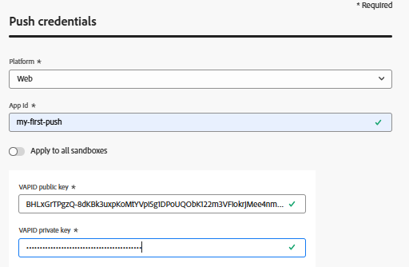

# Creare un canale push

Il primo passaggio consiste nel creare un canale push in Adobe Journey Optimizer. Come parte di questa configurazione, dovrai generare le chiavi VAPID, necessarie per autenticare e abilitare le notifiche push web. Queste chiavi vengono quindi utilizzate nella configurazione del canale push, consentendo ad AJO di inviare in modo sicuro le notifiche agli utenti abbonati.

## Genera chiavi VAPID

VAPID (Voluntary Application Server Identification) è uno standard web push che consente al server di identificarsi nei servizi push (come Chrome, Edge, ecc.) utilizzando coppie di chiavi pubblica/privata, in modo che il provider push sappia chi sta inviando la notifica.

Viene generato utilizzando uno strumento come web-push generate-vapid-keys, che crea una chiave pubblica (condivisa con il browser) e una chiave privata (mantenuta sul server) utilizzate insieme per autenticare e inviare in modo sicuro i messaggi push.

Per questa esercitazione abbiamo utilizzato Node.js per generare le chiavi VAPID.

Verifica che Node.js sia installato. Quindi esegui il seguente comando
```npm install web-push -g ```


```web-push generate-vapid-keys```


## Crea credenziali push

* Accedi a Journey Optimizer

* Passa ad Amministrazione | Canali | IMPOSTAZIONI PUSH | Credenziali push| Crea credenziali push

* 

## Crea configurazione canale

* Accedi a Journey Optimizer

* Passa ad Amministrazione | Canali | Crea configurazione canale
  
