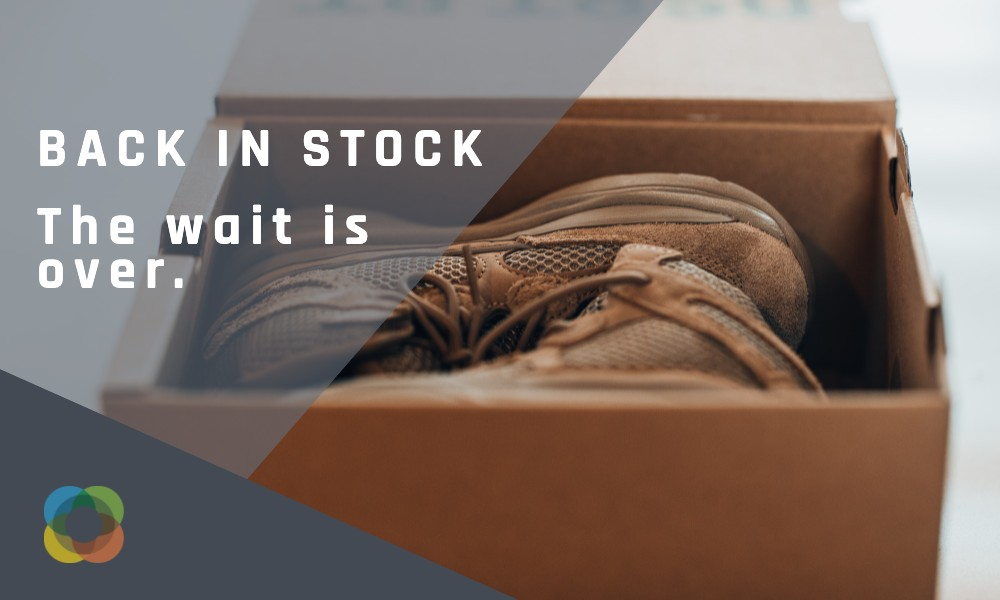

# Journey Optimizer Challenges - Introduzione e prerequisiti

Le sfide forniscono uno scenario e i requisiti necessari per mettere in pratica ciò che hai imparato. Le sfide ti aiutano a valutare il tuo livello di competenza e a identificare le lacune nella conoscenza.

Ogni sfida in questa sezione riguarda un caso d’uso univoco che verrà implementato. Il pubblico di destinazione (tipo) e le competenze richieste sono elencate all’inizio di ogni sfida.

## Prerequisiti

### Requisiti di sistema

* Accesso a una sandbox Journey Optimizer
* Si consiglia di completare la sfida in una sandbox di formazione dedicata. Fai riferimento a [Configurare un tutorial sulla sandbox di formazione](https://experienceleague.adobe.com//docs/journey-optimizer-learn/configure-a-training-sandbox/introduction-and-prerequisites.html) per istruzioni.
* Sono necessari i seguenti diritti di accesso:
   * *Percorsi Manager* o *Amministratore del percorso* diritti
   * Visualizzare i profili di test e i relativi attributi
* È necessario eseguire il provisioning di AEM Assets Essentials per la tua istanza
* Il canale e-mail deve essere configurato per i messaggi transazionali e di marketing

>[!NOTE]
> Gli esercizi sono stati sviluppati in base ai dati di esempio Luma. È consigliabile impostare una sandbox di formazione configurata con i dati di esempio. Visita il tutorial [Importare dati di esempio in Adobe Experience Platform](https://experienceleague.adobe.com/docs/platform-learn/tutorials/import-sample-data.html?lang=en) per istruzioni dettagliate.

### Azioni necessarie

* Se hai poca esperienza con Adobe Journey Optimizer, completa il corso [Guida introduttiva di Journey Optimizer per amministratori e manager di Percorso](https://experienceleague.adobe.com/?recommended=JourneyOptimizer-U-1-2021.1&amp;lang=it).
* Prima di iniziare, scarica il [luma-assets.zip](/help/challenges/assets/email-assets/luma-assets.zip) file. Contiene tutte le risorse necessarie per completare le sfide
* Dalla cartella dei download, sposta il `luma-assets.zip` e decomprimere il file nella posizione desiderata sul computer.

## La storia

Luma è una società di abbigliamento atletico fittizia, con negozi in più paesi, una presenza online con un sito web e app mobili. Luma utilizza Adobe Journey Optimizer per fornire ai propri clienti esperienze connesse, contestuali e personalizzate.

Luma sta cercando di promuovere la sua ultima collezione di abbigliamento e ingranaggi e di stimolare le vendite per i clienti esistenti. Sei stato assunto per implementare le campagne di marketing e fidelizzazione Luma in Journey Optimizer.

## Le tue sfide

<table>
<tr>
<td>
 

      
      

  </td>
  <td>
   <a href="summer-collection-announcement-challenge.md">
    <strong>Creare un annuncio di raccolta estiva </strong>
    </a>
      

      <em>Promuovi la nuova collezione estiva Luma. </em>
      

      <b>Competenze richieste:</b>
      <li><a href="https://experienceleague.adobe.com/docs/journey-optimizer-learn/tutorials/create-segments.html"> Creare segmenti</li>
      <li><a href="https://experienceleague.adobe.com/docs/journey-optimizer-learn/tutorials/create-messages/import-and-author-html-email-content.html">Importare e creare contenuti e-mail HTML</li>
      <li><a href="https://experienceleague.adobe.com/docs/journey-optimizer-learn/tutorials/create-journeys/use-case-read-segment.html">Caso d’uso: attività “Leggi segmento”</li>
  </td>
  </tr>
  <tr>
  <td>
  

    
  </td>
  <td>
      <a href="order-confirmation-challenge.md">
    <strong>Creare una conferma dell’ordine</strong>
    </a>
    

    

    <em>Invia un'e-mail di conferma dell'ordine quando qualcuno completa un acquisto online
    </em>
    

  </td>
  </tr>
  <tr>
    <td>
    

    
    

    <td>
    

      <a href="product-replenishment-challenge.md">
    <strong>Creare una notifica di rifornimento del prodotto </strong>
    </a>
    

    

    <em>Informare i clienti quando un precedente articolo non disponibile è di nuovo disponibile</em>
    

  </td>
  </tr>
  <tr>
    <td>
    

    
    

    <td>
    

      <a href="loyalty-status-welcome-email-challenge.md">
    <strong>Creare un messaggio e-mail di benvenuto per lo stato di fedeltà </strong>
    </a>
    

    

    <em>Invia un'e-mail quando un cliente fidelizzato si sposta su un nuovo livello per congratularsi e informarlo dei suoi nuovi vantaggi</em>
    

  </td>
  </tr>
</table>
