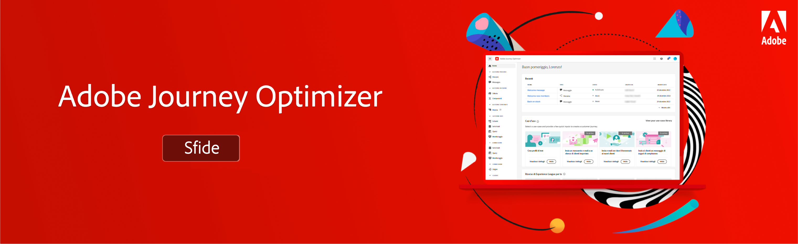

# Journey Optimizer Challenges - Introduzione e prerequisiti

Le sfide forniscono uno scenario e i requisiti necessari per mettere in pratica ciò che hai imparato. Le sfide ti aiutano a valutare il tuo livello di competenza e a identificare le lacune nella conoscenza.

Ogni sfida in questa sezione riguarda un caso d’uso univoco implementato dall’utente. Il pubblico di destinazione (tipo) e le competenze richieste sono elencate all’inizio di ogni sfida.

## Prerequisiti

### Requisiti di sistema

* Accesso a una sandbox Journey Optimizer : abbiamo consigliato di completare la sfida in una sandbox di formazione dedicata.
* È necessario eseguire il provisioning di AEM Assets Essentials per la tua istanza
* Il canale e-mail deve essere configurato per i messaggi transazionali e di marketing

### Diritti di accesso

Sono necessari i seguenti diritti di accesso:
* *Percorsi Manager* o *Amministratore del percorso*
* Visualizzare i profili di test e i relativi attributi

>[!NOTE]
> Gli esercizi sono stati sviluppati in base ai dati di esempio Luma. È consigliabile impostare una sandbox di formazione configurata con i dati di esempio. Visita il tutorial [Configurare una sandbox di formazione](/help/tutorial-configure-a-training-sandbox/introduction-and-prerequisites.md) per istruzioni dettagliate.

### Azioni necessarie

* Se hai poca esperienza con Adobe Journey Optimizer, completa il corso [Guida introduttiva di Journey Optimizer per amministratori e manager di Percorso](https://experienceleague.adobe.com/?recommended=JourneyOptimizer-U-1-2021.1&amp;lang=it).

## La storia

Luma è una società di abbigliamento atletico fittizia, con negozi in più paesi, una presenza online con un sito web e app mobili. Luma utilizza Adobe Journey Optimizer per fornire ai propri clienti esperienze connesse, contestuali e personalizzate.

Luma sta cercando di promuovere la sua ultima collezione di abbigliamento e ingranaggi e di stimolare le vendite per i clienti esistenti. Sei stato assunto per implementare le campagne di marketing e fidelizzazione Luma in Journey Optimizer.

## Le tue sfide

<table>
<tr>
<td>
 

      
      

  </td>
  <td>
   <strong><a href="summer-collection-announcement-challenge.md">Creare un annuncio di raccolta estiva </strong>
    </a>
      

      <em>Crea un percorso che invia un’e-mail di annuncio della raccolta estiva a un segmento di clienti esistenti. </em>
      

      <b>Competenze richieste:</b>
      <li><a href="https://experienceleague.adobe.com/docs/journey-optimizer-learn/tutorials/profiles-segments-subscriptions/create-segments.html"> Creare segmenti</li>
      <li><a href="https://experienceleague.adobe.com/docs/journey-optimizer-learn/tutorials/create-journeys/use-case-read-segment.html">Leggi segmento</li>
       <li><a href="https://experienceleague.adobe.com/docs/journey-optimizer-learn/tutorials/create-messages/create-emails/import-and-author-html-email-content.html">Importare contenuto e-mail di HTML</li>
  </td>
  </tr>
   <tr>
    <td>
    

    
    

    <td>
    

      <a>
    <strong><a href="loyalty-status-welcome-email-challenge.md">Creare un messaggio e-mail di benvenuto per lo stato di fedeltà </strong>
    </a>
    

    

    <em>Invia un'e-mail quando un cliente fidelizzato si sposta su un nuovo livello per congratularsi e informarlo dei suoi nuovi vantaggi.</em>
    

    <b>Competenze richieste:</b>
      <li><a href="https://experienceleague.adobe.com/docs/journey-optimizer-learn/tutorials/profiles-segments-subscriptions/create-segments.html"> Creare segmenti</li>
      <li><a [href="https://experienceleague.adobe.com/docs/journey-optimizer-learn/tutorials/create-journeys/use-case-read-segment-qualification.html">Qualificazione del segmento</li>
      <li><a href="https://experienceleague.adobe.com/docs/journey-optimizer-learn/tutorials/create-messages/create-emails/import-and-author-html-email-content.html">Importare e creare contenuti e-mail HTML</li>
  </td>
  </tr>
  <tr>
  <td>
  

    
  </td>
  <td>
      <a href="order-confirmation-challenge.md">
    <strong><a href="order-confirmation-challenge.md">Creare una conferma dell’ordine</strong>
    </a>
    

    

    <em>Verifica le tue conoscenze su come creare e personalizzare messaggi transazionali
    </em>
    

    <b>Competenze richieste:</b>
      <li><a href="https://experienceleague.adobe.com/docs/journey-optimizer-learn/tutorials/create-messages/create-content-with-the-email-designer.html"> Creare contenuti e-mail con l’editor messaggi</li>
      <li><a href="https://experienceleague.adobe.com/docs/journey-optimizer-learn/tutorials/personalize-content/use-contextual-event-information-for-personalization.html">Utilizzare informazioni contestuali sugli eventi per la personalizzazione</li>
      <li><a href="https://experienceleague.adobe.com/docs/journey-optimizer-learn/tutorials/personalize-content/use-helper-functions-for-personalization.html?lang=en">Utilizzare funzioni di assistenza per la personalizzazione</li>
  </td>
</table>
