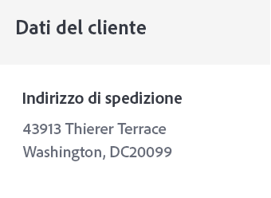

# Creare un messaggio e-mail transazionale di conferma dell’ordine


| Sfida | Creare un messaggio e-mail transazionale di conferma dell’ordine |
|---|---|
| Persona | Percorsi Manager |
| Competenze richieste | <ul><li>[Creare contenuti e-mail con l’editor messaggi](https://experienceleague.adobe.com/docs/journey-optimizer-learn/tutorials/create-messages/create-email-content-with-the-message-editor.html?lang=en)</li> <li>[Utilizzare informazioni contestuali sugli eventi per la personalizzazione](https://experienceleague.adobe.com/docs/journey-optimizer-learn/tutorials/personalize-content/use-contextual-event-information-for-personalization.html?lang=en)</li><li>[Utilizzare funzioni di assistenza per la personalizzazione](https://experienceleague.adobe.com/docs/journey-optimizer-learn/tutorials/personalize-content/use-helper-functions-for-personalization.html?lang=en)</li></ul> |
| Risorse da scaricare | [Risorse di conferma dell’ordine](/help/challenges/assets/email-assets/order-confirmation-assets.zip) |

## La storia

Luma, lancia il loro negozio online e vuole garantire una buona esperienza del cliente, fornendo un&#39;e-mail di conferma dell&#39;ordine una volta che un cliente ha effettuato un ordine.

Crea e personalizza un messaggio di conferma dell’ordine transazionale.

## Ha tutto quello di cui ha bisogno?

## La tua sfida

Crea un messaggio e-mail di conferma dell’ordine che viene attivato quando un cliente Luma completa un ordine online.

### Crea l’e-mail di conferma dell’ordine

Crea un nuovo messaggio e-mail intitolato &quot;(nome utente)_Luma - Conferma ordine&quot;. L’oggetto deve essere personalizzato con il nome del destinatario e deve includere la frase &quot;grazie per il tuo acquisto&quot;

Seguendo la linea guida al marchio Luma, l’e-mail deve essere strutturata come segue:

<table>
<tr>
<td>
  <div>
     <strong> Sezione intestazione</strong>
      </div>
  </td>
  <td>
    <strong>Logo Luma</strong>
      <p>
     <li>luma_logo.png</li>
    <li>Dimensioni 35%, sfondo bianco centrato </li>
    <li>Dovrebbe avere un collegamento al sito web luma: https://publish1034.adobedemo.com/content/luma/us/en.html</li>
    <p>
    Suggerimento: Troverai tutte le immagini nella cartella delle risorse denominate immagini dei messaggi. <p>
    </td>
  </tr>
  <tr>
  <td>
  <div>
    <strong>Sezione Conferma ordine
    </strong>
  </td>
  <td>
    <strong>Immagine</strong><p>
    <li>luma-transactional-order-confirmation-2.jpg </li>
    <li>Margine: Superiore, inferiore (10)<div>
    <p>
    <strong>Testo</strong><p>
    <em>Grazie per l'acquisto!</em><p>
    <li>Allineamento: sinistra  </li>
   <li>Colore testo: rgb(101, 106, 119); font-size:14 px</li>
    <li>Spaziatura: sinistra (95), destra (95)</li><div>
    <p>
     <em>Il tuo ordine è stato effettuato.
    <p>Una volta spedito il tuo pacchetto, ti invieremo un'e-mail con un numero di registrazione in modo da poter tenere traccia del tuo ordine.</p></em>
    </strong><p>
    <li>Allineamento: sinistra  </li>
    <li>Colore testo: rgb(101, 106, 119); font-size:14 px </li>
    <li>Spaziatura: sinistra (95), destra (95)</li><div>
    </a>
    <p>
    <strong>Pulsante:</strong>
   <p><em>Visualizza ordine</em></p>
      <li>Colore di sfondo: rgb(25, 121, 195)</li>
      <li>Colore testo: Bianco</li>
      <li>Nessun bordo</li>
      <li>Altezza: 40</li>
      <li>Aggiungere un collegamento a un sito web desiderato </li>
      <li>Allinea a sinistra con il testo precedente (suggerimento: utilizzare il margine del contenitore)</li>
  </td>
 <tr>
<td>
  <div>
     <strong>Sezione Dettagli ordine</strong>
      </div>
      <p>Suggerimenti:
      <li>Informazioni sull’evento contestuali. Puoi aggiungere il messaggio nel contesto solo dopo aver aggiunto il messaggio al percorso (vedi il passaggio 2). Non pubblicare l’e-mail prima di aggiungerla al Percorso e modificarla con le informazioni sull’evento contestuale!</li>
      <li>Utilizzare la funzione helper: Ogni</li>
      <li>Utilizza il formato dell’editor HTML per i dati contestuali. Inserisci le informazioni nei contenitori utilizzando i tag DIV.</li>
  </td>
  <td>
    <strong>Intestazione</strong>
    <p>
    <em>Ordine {Numero ordine di acquisto}</em>
    </p>
    <strong>Elenco dei prodotti ordinati:
  </strong>
  <p>Ogni elemento deve essere formattato come segue:
    
</p>
<strong>Immagine del prodotto:</strong>
<li>Classe: seggiolone
<li>stile: casella di bordo: min-height:40 px</li>
<li>margine superiore e inferiore:20px</li>
<li>margine sinistro:80px</li>
<li>raggio bordo:0px</li>
<li>Usa come immagine di sfondo per il contenitore</li>
<li>posizione di fondo: 0% 50%</li>
<li>dimensioni sfondo: 60 px</li>
<li>ripetizione in background: no-repeat</li>
<p>
<strong>Prezzo:</strong>
<li>Formato = H5</li>
<li>stile = ridimensionamento casella:bordo-casella</li>
<li>margine inferiore:5 px</li>
<li>margine superiore:0px;</li>
<p>
<strong>Nome e quantità:</strong>
<li>class=text-small</li>
<li>style=box-size: border-box</li>
<li>margine superiore: 5 px</li>
<li>colore: rgb(101, 106, 119)</li>
<li>font-size:14 px</li>
<p>
</td>
  </tr>
</table>

### Creare il percorso

1. Chiama il percorso &quot;il tuo nome _Luma-Order Confirmation&quot;
1. Utilizza l’evento : LumaOnlinePurchase
1. Azione: Aggiungi il messaggio creato al passaggio 1
1. Torna al messaggio e aggiungi gli attributi contestuali
1. Pubblicare l’e-mail

>[!TIP]
>
>Per consentire la risoluzione dei problemi dei percorsi, è consigliabile aggiungere un percorso alternativo a tutte le azioni del messaggio in caso di timeout o errore.

+++Criteri di successo

Attiva il Percorso creato in modalità di test e invia l’e-mail a te stesso:

1. Mostrare i valori nascosti facendo clic sul simbolo dell&#39;occhio:
   1. Nei parametri e-mail fai clic sul simbolo T (abilita sostituzione parametro)
      
   2. Fare clic nel campo Indirizzo
   3. Nella schermata successiva aggiungi il tuo indirizzo e-mail tra parentesi: *yourname@yourdomain* nell’editor espressioni e fai clic su ok.
2. Mettere il percorso in modalità di prova
3. Attiva l&#39;evento con i seguenti parametri:
   * Imposta l’identificatore del profilo su: Jenna_Palmer9530@emailsim.io
   * Tipo evento: commerce.purchase
   * Nome: Kit Yoga Sprite Companion
   * Quantità: 1
   * Totale prezzo: 61
   * Numero ordine: 6253728
   * SKU: 24-WG080
   * productImageURL: <https://publish1034.adobedemo.com/content/dam/luma/en/products/gear/fitness-equipment/luma-yoga-kit-2.jpg>

Dovresti ricevere l’e-mail di conferma dell’acquisto personalizzato, con il prodotto specificato.

* L’oggetto deve iniziare con il nome del profilo di test: Jenna
* La sezione dettagli ordine deve essere compilata con i dettagli ordine immessi durante il test
* Le informazioni sul cliente devono avere la città e il codice postale del profilo di test:

   43913 Terrazza Thierer, Washington DC 20099

+++

+++Controlla il tuo lavoro

**Oggetto:**

{{ profile.person.name.firstName }}, grazie per il tuo acquisto!

**Sezione Intestazione e conferma:**


**Sezione dettagli ordine:**


Ecco come dovrebbe essere il tuo codice:

Header:

```javascript
Order: {{context.journey.events.1627840522.commerce.order.purchaseOrderNumber}}
```

Elenco dei prodotti:

Utilizzare la funzione helper &quot;each&quot; per creare l&#39;elenco dei prodotti. Ecco come dovrebbe essere il tuo codice:

```javascript
{{#each context.journey.events.1911672547.productListItems as|product|}}
<div class="cart-item-chair" style="box-sizing:border-box;min-height:40px;padding-top:20px;padding-bottom:20px;padding-left:80px;border-radius:0px;background-image:url({{product._wwfovlab065.productImageURL}});background-position:0% 50%;background-size:60px;background-repeat:no-repeat;">
<h5 style="box-sizing:border-box;margin-bottom:5px;font-size:16px;line-height:20px;margin-top:0px;">${{product.priceTotal}}.00</h5>
<div class="text-small" style="box-sizing:border-box;padding-top:5px;color:rgb(101, 106, 119);font-size:14px;">{{product.name}}</div><div class="text-small" style="box-sizing:border-box;padding-top:5px;color:rgb(101, 106, 119);font-size:14px;">Quantity: {{product.quantity}}</div></div><div class="divider-small" style="box-sizing:border-box;height:1px;margin-top:10px;margin-bottom:10px;background-color:rgb(209, 213, 223);"> </div>
{{/each}}

Total: ${{context.journey.events.1627840522.commerce.order.priceTotal}} 
```

**Sezione Informazioni cliente**



La personalizzazione dovrebbe essere simile al seguente:

```javascript
{{profile.homeAddress.street1}}
{{profile.homeAddress.city}},{{profile.homeAddress.state}} {{profile.homeAddress.postalCode}}
```

**Piè di pagina:**


**Percorso**


+++

