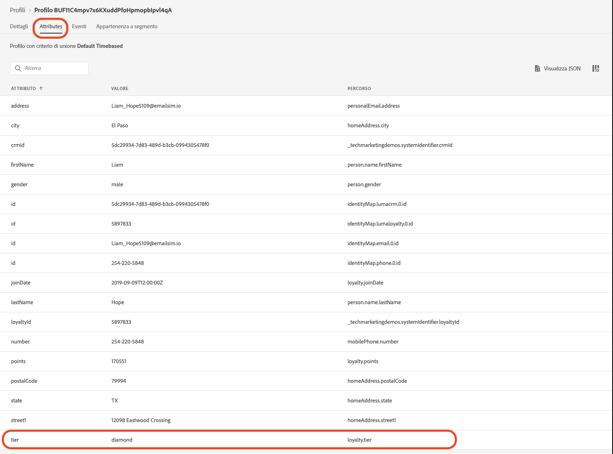
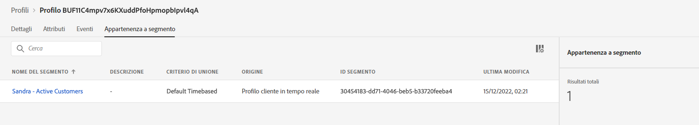

# Crea un annuncio sulla Collezione estiva - sfida


| Sfida | Crea un annuncio sulla Collezione estiva |
|---|---|
| Persona | Gestione del percorso |
| Competenze richieste | <ul><li>[Creare segmenti](https://experienceleague.adobe.com/docs/journey-optimizer-learn/tutorials/profiles-segments-subscriptions/create-segments.html?lang=it)</li><li> [Importare e creare contenuti e-mail HTML](https://experienceleague.adobe.com/docs/journey-optimizer-learn/tutorials/create-messages/create-emails/import-and-author-html-email-content.html?lang=it)</li><li>[Caso d’uso: attività “Leggi segmento”](https://experienceleague.adobe.com/docs/journey-optimizer-learn/tutorials/create-journeys/use-case-read-segment.html?lang=it)</li> |
| Risorse da scaricare | [File e-mail sulla Collezione stagionale](/help/challenges/assets/email-assets/emails-seasonal-collection-announcement.zip) |

{style="table-layout:auto"}

## Il contesto

Luma, un’azienda fittizia di abbigliamento sportivo, sta promuovendo la sua ultima collezione di abbigliamento e attrezzatura per stimolare le vendite per i clienti esistenti. Luma sta lanciando la nuova collezione estiva e desidera mirare in modo specifico diversi segmenti di clienti.

## La tua sfida

Il team di marketing Luma ti chiede di implementare una campagna di marketing per la collezione estiva in Journey Optimizer. La sfida è quella di:

* creare un segmento che definisce quali profili sono idonei a ricevere la promozione.
* Creare il percorso.

### Passaggio 1: definire il segmento - clienti attivi

>[!BEGINTABS]

>[!TAB Attività]

#### Crea un segmento in [!DNL Journey Optimizer]

* In [!DNL Journey Optimizer], crea un segmento denominato *Clienti attivi*.
* Il segmento deve includere solo clienti Luma attivi.
* I clienti attivi sono definiti come clienti che hanno un livello nel programma fedeltà di Luma (bronzo, argento, oro o platino).


>[!TAB Criteri di successo]

Nel generatore di segmenti puoi visualizzare il numero stimato di profili idonei. Se utilizzi i dati della sandbox di formazione, hai circa 753 profili idonei su 1,29 mila.

>[!NOTE]
>Per visualizzare l’appartenenza a un segmento per i profili esistenti possono essere necessarie fino a 24 ore, in quanto i profili esistenti devono essere recuperati.

**Un profilo idoneo è stato aggiunto al segmento:**

Puoi controllare i profili aggiunti al segmento idoneo accedendo a uno dei profili elencati nella visualizzazione dei dettagli del segmento.

Nella pagina del profilo, seleziona la scheda [!UICONTROL Attributi] per confermare che sono idonei: il livello deve essere argento, oro, platino o diamante.



Puoi anche controllare la scheda [!UICONTROL Appartenenza a un segmento] in cui è elencato il tuo segmento.



>[!TAB Verifica il tuo lavoro]

Campi del segmento: **[!UICONTROL Attributi]** > **[!UICONTROL Profilo individuale XDM]** > **[!UICONTROL Fedeltà]** > **[!UICONTROL Livello]**

Ecco come dovrebbe apparire il tuo segmento:


Il codice deve essere simile al seguente:

```javascript
stringCompare("equals", loyalty.tier, ["diamond", "gold", "platinum", "silver"], false)
```

>[!ENDTABS]


### Passaggio 2: creare il percorso dell’annuncio sulla Collezione estiva

>[!BEGINTABS]

>[!TAB Attività]

#### Invia l’annuncio sulla Collezione estiva

Un’agenzia ti ha fornito quattro file HTML con la progettazione per le e-mail:

* `SeasonalCollectionEmail.html`
* E-mail sulla collezione uomo di Luma
* E-mail sulla Collezione donna di Luma
* Luma - e-mail 20% di sconto sulla collezione

1. [Scarica i file e-mail sulla Collezione stagionale](/help/challenges/assets/email-assets/emails-seasonal-collection-announcement.zip).

1. Crea un percorso denominato *Luma - Annuncio sulla collezione estiva* sulla base delle seguenti linee guida:

   1. Invia un’email *Luma - Annuncio sulla nuova collezione estiva* al segmento *Clienti attivi* mantenendo il 10% del pubblico come gruppo di controllo
      * Titolo del messaggio *Luma - Annuncio sulla collezione estiva*
      * Oggetto *(nome del destinatario), la nuova collezione estiva Luma è arrivata!*
      * Utilizza il file HTML `SeasonalCollectionEmail.html` fornito come corpo dell’e-mail.
   1. Attendi due giorni e invia un messaggio e-mail di follow-up con contenuto più mirato:
      * I clienti maschi devono ricevere l’e-mail **Collezione da uomo Luma**.
         * Titolo del messaggio: *Collezione da uomo Luma*
         * Oggetto: *(nome del destinatario), dai un’occhiata al nuovo abbigliamento sportivo da uomo!*
         * Corpo dell’e-mail: `MensCollectionEmail.html` come corpo dell’e-mail.
      * I clienti femmina devono ricevere l’e-mail **Collezione da donna Luma**.
         * Titolo del messaggio: *Collezione da donna Luma*
         * Oggetto: *(nome del destinatario), esplora la Collezione da donna di Luma!*
         * Corpo dell’e-mail: `WomensCollectionEmail.html`
      * Gli altri clienti devono ricevere l’e-mail **Luma - 20% di sconto sulla collezione**.
      * Titolo del messaggio: *Luma - 20% di sconto sulla collezione*
      * Oggetto: *(nome del destinatario), approfitta del 20% di sconto!*
      * Corpo dell’e-mail: `20OOffCollectionEmail.html`
   1. Dopo aver inviato le e-mail mirate precedenti, attendi due giorni per l’apertura.
   1. Se l’e-mail mirata non viene aperta entro 2 giorni, invia una **e-mail Luma 20% di sconto sulla collezione** come tentativo finale di retargeting


>[!TAB Criteri di successo]

#### Visualizza l’anteprima delle e-mail

**Messaggio e-mail #1 - Luma - Annuncio sulla collezione estiva**

Visualizza l’anteprima del messaggio e-mail:

1. Aggiungi un profilo di test: Louise Petti:
   * Spazio dei nomi delle identità: *ID CRM Luma*
   * Valore identità: *d1f132f9f9502bba047a6ec86c4b61f9*

Risultato:

* L’oggetto deve contenere il testo: Louise, la nuova collezione Luma è arrivata!

**Messaggio e-mail #2 - Collezione da uomo Luma**

Invia una bozza a te stesso:

1. Aggiungi un profilo di test: Stanleigh Stooke:
   * Spazio dei nomi delle identità: *ID CRM Luma*
   * Valore identità: `4f34057d9d9e792c28ba18ecae378e98`
2. Seleziona il profilo di test: Stanleigh Stooke.
3. Invia una bozza a te stesso.

Risultato:\
Dovresti ricevere un’e-mail. L’oggetto deve contenere il testo *Stanleigh, scopri il nuovo abbigliamento sportivo da uomo!* e il corpo dell’e-mail deve corrispondere a quello visualizzato nell’anteprima.

>[!NOTE]
>La ricezione della bozza potrebbe richiedere un paio di minuti.

**Messaggio e-mail #3 - Collezione da donna Luma**

Visualizza l’anteprima del messaggio e-mail con il profilo di test *Louise Petti.*

* L’oggetto deve contenere il testo: *Louise, esplora la Collezione da donna di Luma!*

**Messaggio e-mail #4 - Luma 20% di sconto sulla collezione**

Visualizza l’anteprima del messaggio e-mail con il profilo di test *Louise Petti.*

* L’oggetto deve contenere il testo: *Louise, approfitta del 20% di sconto!*

#### Test del percorso

>[!IMPORTANT]
>
>Prima di impostare il percorso in modalità di test:
>
>1. Assicurati che [!UICONTROL Attività Leggi segmento] presenti lo spazio dei nomi impostato su **ID CRM Luma (lumaCrmId)**
>1. Per ogni e-mail, sovrascrivi i parametri e-mail predefiniti per le e-mail in modo che vengano inviati al tuo indirizzo e-mail:
>    * Mostra i valori nascosti facendo clic sul simbolo a forma di occhio.
>    * Nei parametri e-mail, fai clic sul simbolo T (abilita sostituzione parametro).
>
>      
> 
>    * Fai clic sul campo [!UICONTROL Indirizzo]
>    * Nella schermata successiva, aggiungi il tuo indirizzo e-mail tra parentesi: `"yourname@yourdomain"` nell’editor di espressioni e fai clic su ok.
>

Testa il percorso e invia le e-mail al tuo account:

1. Metti il percorso in modalità di test.
1. Seleziona **[!UICONTROL Profilo singolo alla volta]**.
1. Tempo di attesa: imposta il timer su 120 secondi (digitalo nel campo).
1. Attiva l’entrata del profilo
1. È possibile eseguire il test di ogni ramo utilizzando uno dei seguenti *ID CRM Luma* come identificatori di profilo:
   * Femmina: Leora Dietsche. Valore identità: `a8f14eab3b483c2b96171b575ecd90b1`
   * Maschio: Stanleigh Stooke. Valore identità: `4f34057d9d9e792c28ba18ecae378e98`
   * Genere non specificato: Louise Petti. Valore identità: `d1f132f9f9502bba047a6ec86c4b61f9`

1. Dopo aver attivato l’entrata del profilo, dovresti ricevere la prima e-mail. L’intestazione deve essere personalizzata in base al profilo scelto.
1. Il percorso deve continuare nel rispettivo ramo e dovresti ricevere l’e-mail correlata (ad esempio, se hai scelto *Jenna*, riceverai l’e-mail *Collezione da donna Luma*).
1. Apri la seconda e-mail e il percorso dovrebbe terminare.
1. È possibile ripetere il passaggio 4. - 7. per tutti e tre i profili per verificare se i rami funzionano correttamente.
1. Per verificare i timeout, imposta il tempo di attesa su 30 secondi e attiva nuovamente la voce.
1. Non aprire le e-mail che ricevi (non visualizzare l’anteprima del messaggio e-mail (!)) e lascia che il tempo di attesa scada.

Dovresti ricevere le e-mail seguenti:

* Luma - Annuncio sulla nuova collezione stagionale
* A seconda del profilo di test utilizzato, dovresti ricevere una delle seguenti e-mail:
   * Leora: Collezione da donna Luma
   * Stanleigh: Collezione da uomo Luma
   * Louise: Luma - 20% di sconto sulla collezione
* Se non hai aperto la seconda e-mail: Luma - 20% di sconto sulla collezione

>[!TAB Verifica il tuo lavoro]

Ecco come dovrebbe apparire il tuo percorso:


**Condizione - Gruppo di controllo:**


**Condizione - Genere:**\


>[!ENDTABS]
