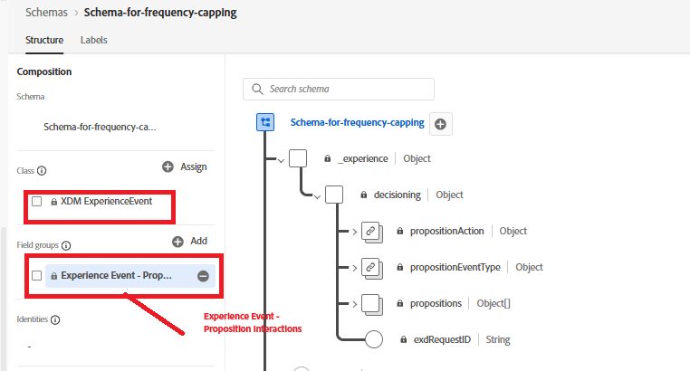

# Abilitare il limite di frequenza per una campagna AJO

La procedura seguente illustra come applicare il limite di frequenza alle offerte:

## Aggiornare lo schema dell’evento

* Aggiorna lo schema evento esistente aggiungendo il gruppo di campi come mostrato
* 

## Aggiornare il limite di frequenza per l’offerta

* 

## Aggiungi token di tracciamento all’offerta

Modifica il criterio di decisione utilizzato nella campagna aggiungendo un’offerta di fallback

Puoi aggiungere trackingToken ed ItemID facendo clic sull’icona Criterio decisione nella navigazione a sinistra, quindi espandere la struttura decisionale per selezionare itemID e trackingToken.

Aggiungi l’ID articolo e il token di tracciamento all’elemento div contenente l’offerta come mostrato di seguito

In questo modo ogni offerta sottoposta a rendering include un token di tracciamento dei dati, essenziale per il tracciamento accurato degli eventi di impression e clic.

Attiva la campagna modificata.

## Inviare eventi di impression e tracciamento

Modifica il codice JavaScript esistente per acquisire e inviare gli eventi di impression e interazione dell’offerta a Adobe Experience Platform utilizzando Adobe Web SDK. Fai riferimento al [codice di esempio fornito qui.](capture-impression-click-events.md)
