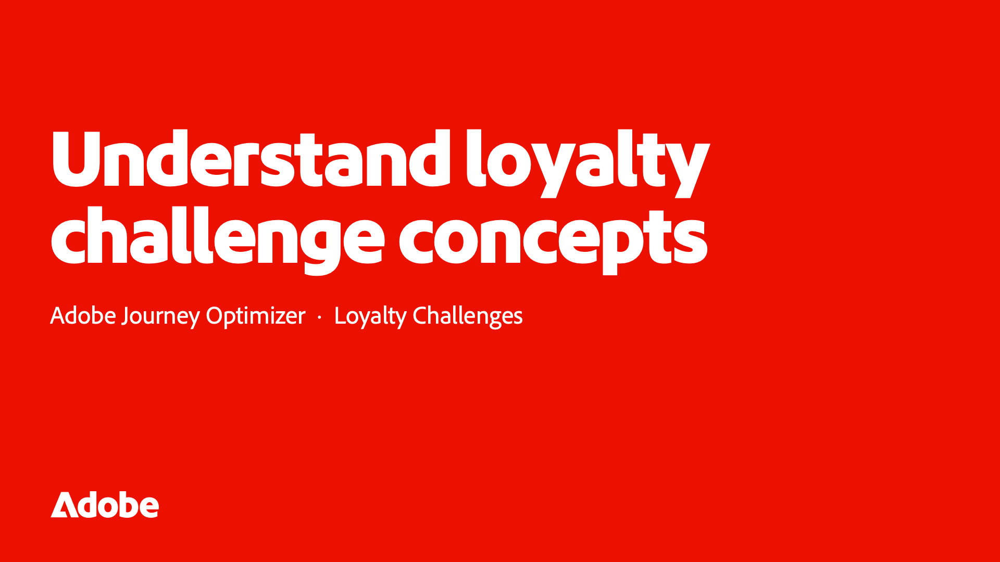
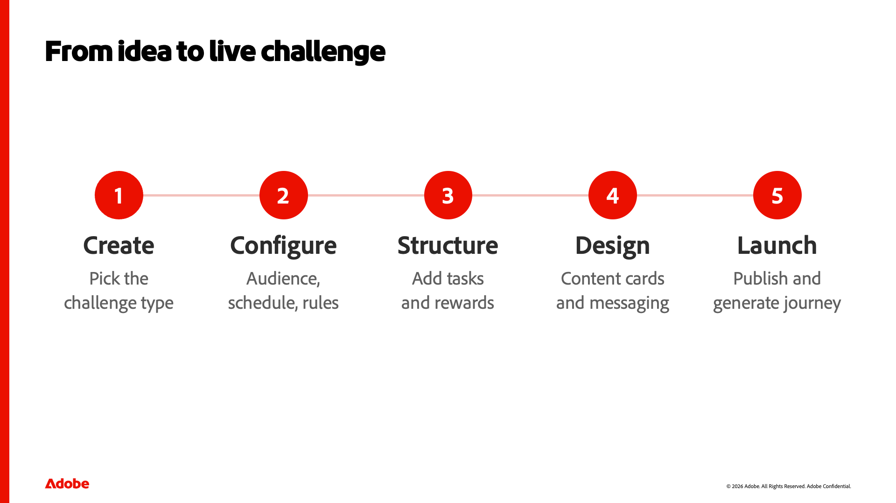

::::slides

:::intro

## Comprendere i concetti della sfida di fedeltà

Prima di creare qualsiasi cosa in Adobe Journey Optimizer Loyalty, è utile comprendere cos’è una sfida di fedeltà e di quali pezzi è composta. Questa lezione costruisce un vocabolario condiviso, cos&#39;è una sfida, i suoi elementi costitutivi fondamentali di sfida, compiti e premi, i tipi di sfide disponibili e come si realizza, in modo che le lezioni pratiche che seguono abbiano un senso.

:::

:::slide

### Comprendere i concetti della sfida di fedeltà

Benvenuto. In questa lezione verrà creato un vocabolario condiviso per Adobe Journey Optimizer Loyalty. Prima di creare qualsiasi cosa, aiuta a capire cosa sia in realtà una sfida di fedeltà e di quali pezzi fondamentali sia fatta. Questo è ciò che abbiamo di fronte — i concetti — le lezioni pratiche che seguono hanno un senso.

:::

:::slide

### Che cos’è una sfida di fedeltà?

Quindi, cos&#39;è una sfida di fedeltà? Nel modo più semplice, è un modo per trasformare il vostro programma fedeltà in un gioco. Ricompensi i clienti per azioni specifiche: fare un acquisto, scrivere una recensione, segnalare un amico, impegnarsi nel sociale. Una sfida stabilisce un obiettivo e le regole per raggiungerlo. I clienti fanno progressi completando le attività e completandole, o completando l&#39;intera sfida, ottengono dei premi. Inoltre, poiché tutto viene eseguito sui dati di Experience Platform, l’avanzamento viene tracciato automaticamente, senza alcuno sviluppo personalizzato.

:::

:::slide

### L&#39;anatomia di una sfida

Ogni sfida è costruita su tre parti, e queste sono le tre parole su cui ancorarsi. Primo, la sfida stessa — l&#39;obiettivo generale e le sue regole: il tipo, il pubblico, la pianificazione e come viene tracciato il progresso. In secondo luogo, le attività: le singole azioni che un cliente completa, come un acquisto o una revisione. Una sfida raggruppa una o più attività. E terzo, i premi — ciò che i clienti guadagnano, consegnati a tappe o quando completano l&#39;intera sfida. Sfida, compiti, premi — se non ricordate nient&#39;altro, ricordate questi tre.

:::

:::slide

### Modi per strutturare una sfida

Le sfide si presentano in alcune forme, a seconda del comportamento che si desidera guidare. Una sfida standard consente ai clienti di completare un numero qualsiasi di attività in qualsiasi ordine, per una maggiore flessibilità. Una sfida Streak chiede loro di ripetere lo stesso compito consecutivamente — pensare di comprare caffè sette giorni di seguito. Una sfida sequenziale richiede attività in un ordine impostato, il che è ottimo per i percorsi di onboarding. E c&#39;è un quarto, Bring your own data, in cui le attività e i premi derivano dalla tua integrazione di fidelizzazione - anche se oggi quella ha una disponibilità limitata.

:::

:::slide

### Dall&#39;idea alla sfida dal vivo

Ecco come si uniscono questi pezzi quando ne costruite uno. Per iniziare, crea la sfida e selezionane il tipo. Puoi configurarne le impostazioni: pubblico, pianificazione e regole. Per conferirgli una struttura, aggiungi attività e premi. Puoi progettare l’aspetto che avrà per i clienti le schede di contenuto e, facoltativamente, impostare la messaggistica per il lancio, l’avanzamento e il completamento. Infine, si lancia — si pubblica la sfida e si genera il percorso che tiene traccia dei progressi di tutti. Approfondiamo ognuno di questi aspetti nelle lezioni successive; per ora, notate solo la forma del flusso.

:::

:::slide

### Termini chiave da ricordare

Blocchiamo il vocabolario. Una sfida è l’obiettivo generale, il tipo e le regole. Un&#39;attività è un&#39;azione che un cliente compie. Una ricompensa è ciò che guadagnano, ad un traguardo o al completamento. Una scheda di contenuto rappresenta il modo in cui la sfida viene visualizzata sul dispositivo di un cliente. La messaggistica riguarda i momenti di lancio, avanzamento e completamento. Il percorso è il flusso generato automaticamente che segue il progresso dietro le quinte. Vedrai tutti e sei questi termini nel resto del corso.

È il modello mentale. Ora sapete cos&#39;è una sfida di fedeltà, i suoi tre componenti, i tipi disponibili, e come prende vita una sfida. Successivamente, apriamo il prodotto e facciamo un tour dell’area di lavoro.

:::

:::slide

### 

:::

::::
