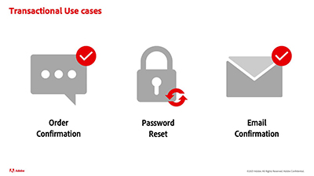

# Tutorials Journey Optimizer - Panoramica

Journey Optimizer aiuta le aziende a fornire ai loro clienti esperienze connesse, contestuali e personalizzate. Per “percorso del cliente” si intende l’intero processo delle interazioni del cliente con il brand, dal primo contatto fino a quando il cliente esce dal sito.

La presente guida utente contiene video e tutorial sulle funzioni e caratteristiche di Adobe Journey Optimizer.

## Novità

### Tutorial

* **[Maschera dati nei messaggi](/help/privacy/mask-data-in-messages.md)**

   *Scopri cos’è il mascheramento dei dati e perché mascherarli. Scopri come mascherare i dati nei messaggi Journey Optimizer.*

* **[Creare una campagna](/help/create-champaigns/create-a-campaign.md)**

   *Scopri come distribuire contenuti una tantum a un pubblico specifico eseguendo azioni immediatamente o secondo una pianificazione specifica.*

* **[Configurare, creare e inviare messaggi SMS](/help/create-messages/configure-author-and-deliver-sms-messages.md)**

   *Scopri come configurare, creare e includere la messaggistica SMS nei tuoi percorsi cliente.*

### Eventi Experience League Live

* **[Notifiche push con Adobe Journey Optimizer](https://experienceleague.adobe.com/docs/experience-league-live-events/events/episodes/exl-live-episode-05-12-22.html?lang=it)**

   *In questo episodio di Experience League Live, parleremo dei casi d’uso comuni per le notifiche push con Adobe Journey Optimizer e approfondiremo i dettagli tecnici per sapere come configurare un’app per il push basato su Adobe Experience Platform.*

## Proposte del nostro staff

<table>
<tr>
  <td>
    
    

      <a href="./introduction/journey-optimizer-overview-part-1.md">
    <strong>Panoramica di Journey Optimizer - Parte 1 </strong>
    </a>
    

    

    <em>Questo video mostra come i brand possono utilizzare Adobe Journey Optimization per fornire percorsi omni-channel personalizzati ai propri consumatori.</em>
    

  </td>
    <td>
    
    

      <a href="./introduction/journey-optimizer-overview-part-2.md">
    <strong>Panoramica di Journey Optimizer - Parte 2 </strong>
    </a>
    

    

    <em>Questo video mostra come i marchi possono utilizzare le funzionalità di Adobe Journey Optimizer per la gestione delle decisioni, la qualificazione dei segmenti in tempo reale e la gestione degli eventi di business, per ottimizzare i percorsi dei clienti.</em>
    

  </td>
  </td>
    <td>
    
    

      <a href="./decision-management/create-decisions.md">
    <strong>Introduzione alle funzionalità di gestione delle decisioni </strong>
    </a>
    

    

    <em>Il video illustra le problematiche aziendali che è possibile risolvere con la gestione delle decisioni, le funzionalità chiave, l’architettura di base e i principali casi di utilizzo.

</em>
    

  </td>
</tr>
<tr>
  <td>
    
    

      <a href="./create-journeys/use-case-transactional-journey.md">
    <strong>Caso d’uso: percorso transazionale </strong>
    </a>
    

    

    <em>Comprendi i casi d’uso applicabili ai percorsi transazionali. Scopri come creare percorsi transazionali e quali best practice applicare.</em>
    

  </td>
    <td>
    
    

      <a href="./personalize-content/use-contextual-event-information-for-personalization.md">
    <strong>Utilizzare informazioni contestuali sugli eventi per la personalizzazione </strong>
    </a>
    

    

    <em>Scopri come personalizzare un messaggio utilizzando le informazioni contestuali sugli eventi provenienti da un percorso.</em>
    

  </td>
  </td>
    <td>
    
    

      <a href="./report-and-monitor/live-and-global-reports.md">
    <strong>Rapporti live e globali </strong>
    </a>
    

    

    <em>Scopri la differenza tra rapporti live e globali, come trovare e analizzare i rapporti specifici per percorsi e messaggi, e come modificare le dashboard dei rapporti.

</em>
    

  </td>
</tr>
</table>
