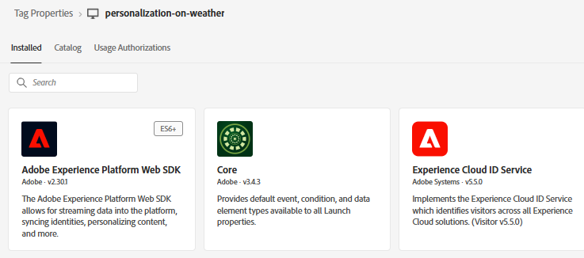
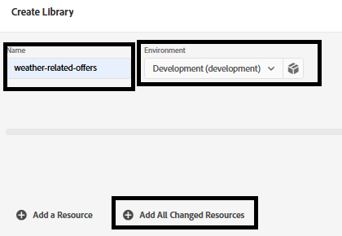

# Creazione di tag Adobe Experience Platform

I tag Adobe Experience Platform (precedentemente Adobe Launch) consentono di gestire e distribuire* tecnologie di marketing e analisi sul sito web senza dover modificare il codice del sito.

Questo [video descrive il processo di creazione dei tag esperienza Adobe](https://experienceleague.adobe.com/en/playlists/experience-platform-get-started-with-tags)

* Accedi a Raccolta dati
* Fai clic su _**Tag -> Nuova proprietà**
* Crea un tag Adobe Experience Platform denominato _**personalization-on-weather**_.
* Aggiungi le seguenti estensioni al tag

* Aggiungi un elemento dati denominato &quot;ECID&quot; come mostrato di seguito. Questo elemento dati viene utilizzato successivamente nel reporting

* Assicurarsi di configurare Adobe Experience Platform Web SDK in modo che utilizzi l&#39;ambiente corretto e lo **stream di dati correlato al meteo** creato nel passaggio precedente.

## Creare e distribuire i tag di AEP

Crea una nuova libreria e aggiungi a essa tutte le risorse modificate, come illustrato nelle schermate seguenti.

**Aggiungi libreria**

**Crea una libreria**

Nella schermata Crea libreria specifica il nome della libreria e l’ambiente.

Aggiungi tutte le risorse modificate a questa libreria

Quindi fai clic sul pulsante Salva e genera in sviluppo per generare la libreria

## Includi tag AEP nella pagina HTML

Quando pubblichi una proprietà AEP Tags, Adobe ti fornisce un tag script che devi inserire all&#39;interno del tuo HTML ` <head>` o nella parte inferiore dei tag ` <body>`.

1. Vai alla proprietà Tag (personalization-on-weather).
2. Fai clic su Ambienti e sull’icona Installa dell’ambiente desiderato (ad esempio Sviluppo, Staging, Produzione).
3. Prendi nota del codice incorporato. È necessario in una fase successiva di questa esercitazione.
