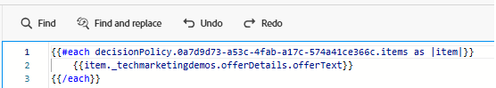

# Creare una campagna

Per distribuire offerte personalizzate agli utenti sulla pagina web, è stata creata una campagna in Adobe Journey Optimizer e configurata con il canale web corretto. Questa configurazione assicura che le offerte vengano consegnate tramite decisioni in tempo reale agli utenti che interagiscono con il sito web.

All’interno di questa campagna, è stato definito un criterio di decisione per controllare la modalità di selezione delle offerte. La politica decisionale comprende una strategia di selezione che consiste in:

- Una raccolta di elementi dell’offerta (ad esempio, in base a tag relativi al meteo),
- Regole di idoneità che determinano le offerte valide per un utente e
- Formula di classificazione che assegna punteggi alle offerte idonee per assegnare la priorità a quelle più rilevanti.

Quando un utente visita il sito web, il sistema ne rileva la posizione e recupera la temperatura corrente utilizzando un’API meteo. Questi dati sulla temperatura vengono quindi inviati a Adobe Experience Platform tramite Web SDK (Alloy). In base a questi dati contestuali in tempo reale, Adobe Journey Optimizer valuta le offerte predefinite taggate per condizioni meteo specifiche, ad esempio caldo, leggero o freddo. L’offerta più rilevante utilizzando la strategia di selezione e la formula di classificazione viene renderizzata automaticamente sulla pagina web utilizzando il motore decisionale di Adobe, garantendo che l’utente riceva contenuti personalizzati in linea con il meteo corrente nella sua area.

## Passaggi di alto livello per creare una campagna in AJO

- Creare una configurazione di canale
   - Definisci dove e come vengono visualizzate le offerte (ad esempio, una pagina web con un’esperienza basata su codice).
   - Accedi a Percorsi Optimizer
   - Passa a _&#x200B;**Amministrazione ->Canali->Crea configurazione canale**&#x200B;_
   - **Nome**: `offers-by-weather`\
     Identifica questa configurazione per la consegna personalizzata delle offerte web.
   - **Piattaforma**: `Web`\
     Destinato specificamente ai browser web. Nessun canale mobile abilitato.
   - **Tipo di esperienza**:

     `Code-based experience`\
     Le offerte non vengono iniettate direttamente nel DOM. Al contrario, AJO restituisce HTML non elaborato che viene analizzato utilizzando JavaScript personalizzato.
   - **URL pagina**: `https://gbedekar489.github.io/weather/weather-offers.html`\
     Il canale è configurato per una pagina di test specifica utilizzata durante lo sviluppo.
   - **Posizione a pagina**: `offerContainer`\
     Le offerte restituite vengono analizzate dinamicamente e sottoposte a rendering in questo contenitore utilizzando la logica front-end.

   - **Formato contenuto**: `HTML`\
     Le offerte vengono distribuite come frammenti HTML non elaborati, che consentono il pieno controllo su come vengono formattate, filtrate e visualizzate.

- **Avvia una nuova campagna**
   - Passa alla sezione Campagne e crea una nuova campagna di marketing pianificata. Assegna un nome appropriato alla campagna.
   - **Aggiungi azione**
      - Aggiungi un’azione basata su codice e collega l’azione a una configurazione di canale creata in precedenza.

   - **Pubblico**
      - Tutti i visitatori (impostazione predefinita).
      - Tipo di identità: ECID (Experience Cloud ID)
Questa impostazione utilizza l’ECID come identità principale per il riconoscimento degli utenti.

- **Crea criterio di decisione**
   - L&#39;azione è collegata a un **criterio di decisione** che definisce la modalità di selezione delle offerte e il numero di offerte restituite per la visualizzazione. Questo criterio utilizza una **strategia di selezione** creata in precedenza nell&#39;esercitazione.
   - Per inserire il criterio di decisione, fai clic su **_Modifica contenuto_** nelle sezioni Azioni, quindi su **_Modifica codice_** per aprire l&#39;editor di personalizzazione.
   - Seleziona l&#39;icona _&#x200B;**Criterio decisione**&#x200B;_ a sinistra e fai clic sul pulsante **Aggiungi criterio decisione** per aprire la schermata **Crea criterio decisione**. Specifica un nome significativo per il criterio di decisione e seleziona il numero di elementi che il criterio di decisione deve restituire. Il valore predefinito è 1.
   - Fai clic su **_avanti_** e aggiungi la strategia di selezione creata nel passaggio precedente al criterio di decisione, quindi fai clic su **avanti** per completare il processo di creazione del criterio di decisione. Non sono state associate offerte di fallback ai criteri di decisione.

- **Inserisci criterio di decisione**
  

  Inserire il criterio di decisione appena creato facendo clic sul pulsante _&#x200B;**Inserisci criterio**&#x200B;_. Inserisce un ciclo for nell’editor di personalizzazione sul lato destro.
Posizionare il cursore tra ogni ciclo sulla riga due e inserire offerText spostandosi sull&#39;offerta espandendo `tenant name`

  Il codice Handlebars esegue un ciclo tra le offerte restituite da un criterio di decisione specifico in Adobe Journey Optimizer.
  

- **Pubblica la campagna**\
  Attiva la campagna per iniziare a consegnare offerte personalizzate in tempo reale.

