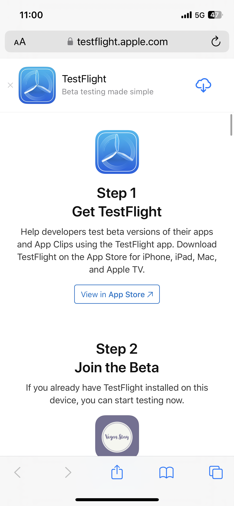

# Laboratorio di Adobe Summit L731 - Scheda di riferimento rapido

In questa pagina sono presenti testi e collegamenti utilizzati nel Laboratorio di Adobe Summit L731. Consente di copiare e incollare il contenuto nei messaggi di Journey Optimizer.

## Esercizio 1.1: scaricare e installare l’app

Scansiona il QR code per scaricare l’app

>[!BEGINTABS]

>[!TAB iOS]

Ti verrà chiesto di installare Testflight, passaggi da 1 a 4. Una volta installato Testflight segui i passaggi da 5 a 8 per installare l’app Vegas Stay:

<table>
<tr>
</tr>
<tr>
<td>
 

      

      <b>Passaggio 1 </b>
      

      
      

  </td>
  <td>
 

      

      <b>Passaggio 2 </b>
      

      
      

  </td>
  <td>
 

      

      <b>Passaggio 3 </b>
      

      
      

  </td>
  <td>
 

      

      <b>Passaggio 4 </b>
      

      
      

  </td>
  </tr>
  <tr>
<td>
 

      

      <b>Passaggio 5 </b>
      

      
      

  </td>
  <td>
 

      

      <a>
<b>Passaggio 6 </b>
      

        
      </a>
      

  </td>
  <td>
 

      

      <a>
<b>Passaggio 7 </b>
      

        
      </a>
      

  </td>
  <td>
 

      

      <a>
<b>Passaggio 8 </b>
      

        
      </a>
      

  </td>
  </tr>
</table>

>[!TAB Android]

Poiché l’app non è registrata in Google Play Store, riceverai un messaggio di avviso:

Fai clic su **Installa comunque**

>[!ENDTABS]

## Esercizio 1: accedere a Adobe Journey Optimizer

[Fai clic qui per accedere a Journey Optimizer](https://experience.adobe.com/#/@techmarketingdemos/sname:summit-2023-ajo-lab/journey-optimizer/home)

**Dettagli di accesso:**

* **Nome utente:** `L731+<your seat number>@summitlab.us` (esempio: L731+001@summitlab.us)
* **Password:** Adobe2023.

## Esercizio 2 Creare una campagna in-app

| Campo | Testo | Collegamenti |
|----|----|----|
| Nome della campagna | `<your seat number> Vegas Stay Campaign` |  |
| Corrispondenza | booknow |  |
| Opzione URL del contenuto multimediale |  | https://i.ibb.co/NstLhjW/Firefly-Poster-with-heading-Adobe-Max-84773.jpg |
| Titolo | Ottieni il tuo sconto anticipato per uccello! |  |
| Corpo | Adobe Max ritorna a Las Vegas. Preparati ad ascoltare relatori stimolanti, sessioni per ampliare le competenze e nuove connessioni. Prenota subito la tua suite e ottieni uno sconto del 10%. |  |
| Pulsante | Ottieni il tuo 10% di sconto! | lab://booking?suite=presidential&amp;discount=10 |
| Pulsante: evento interattivo | CTA in-app |  |
| URL di base da utilizzare per l&#39;anteprima sul dispositivo |  | **iOS:** lab://  **Android**: https://lab |

## Esercizio 3: Creare una notifica push

| Campo | Testo | Collegamenti |
|----|----|----|
| Nome della campagna | `<your seat number> Max Push Campaign` |  |
| Opzione URL del contenuto multimediale |  | https://i.ibb.co/NstLhjW/Firefly-Poster-with-heading-Adobe-Max-84773.jpg |
| Titolo | Ehi! |  |
| Corpo | Lo sapevi che Adobe Max sta tornando a Las Vegas? Prenota subito la tua camera e ottieni uno sconto del 10%. |  |
