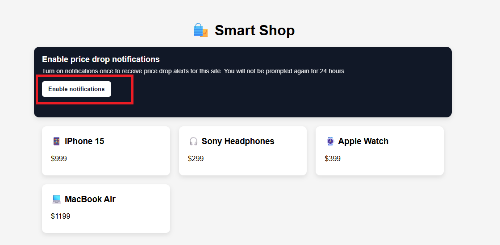
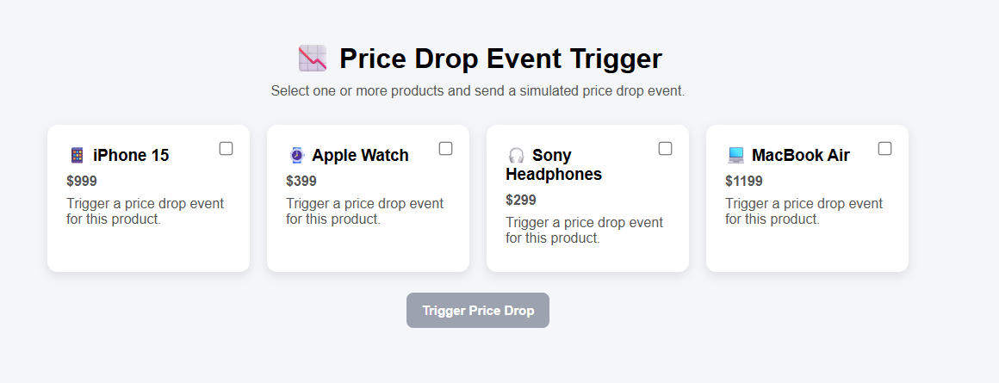

# Push web in Adobe Journey Optimizer

Le notifiche web push sono un modo potente per coinvolgere nuovamente gli utenti in tempo reale e questo tutorial illustra i passaggi necessari per implementarle con Adobe Journey Optimizer (AJO). Inizierai utilizzando il Web SDK per acquisire le preferenze di consenso degli utenti per le notifiche push, garantendo un’esperienza di abbonamento fluida e conforme. Successivamente, creerai una campagna per inviare notifiche push agli utenti che hanno acconsentito, abilitando il coinvolgimento basato sul pubblico. Infine, imparerai a sfruttare i tag di AEP per attivare un evento personalizzato di calo dei prezzi, che avvia un percorso in AJO e fornisce notifiche push tempestive e personalizzate in base al comportamento degli utenti in tempo reale.

Pagina web di esempio per consentire agli utenti di dare il consenso per le notifiche

Pagina web di esempio per attivare l’evento di calo dei prezzi

## Prerequisiti

Questo tutorial è progettato per essere pratico e facile da seguire. Anche se non è richiesta alcuna competenza approfondita, sarà utile acquisire una conoscenza di base dei seguenti concetti:

- Adobe Journey Optimizer (creazione di percorsi o campagne)
- Raccolta dati di AEP (tag) e Web SDK
- Concetti di base di Adobe Experience Platform come schemi ed eventi
- Alcuni concetti di JavaScript e di sviluppo web generale
- Conoscenza di base di Node.js (per generare chiavi VAPID e gestire un endpoint di configurazione semplice)

Se sei alle prime armi con una di queste aree, non preoccuparti: il tutorial ti guiderà attraverso i passaggi chiave del percorso.
Questo tutorial si concentra sull’implementazione di un caso di utilizzo end-to-end di notifiche web push, in modo che una conoscenza pratica degli strumenti e dei concetti di cui sopra ti aiuterà a seguire il percorso in modo efficace.

## 🔔 Abilita notifiche browser

Se le notifiche sono bloccate o non vengono visualizzate, potrebbe essere necessario abilitarle nelle impostazioni del browser. Consulta le guide seguenti:

- **Google Chrome (Windows/macOS)**\
  <https://support.google.com/chrome/answer/3220216>

- **Microsoft Edge (Windows)**\
  <https://support.microsoft.com/en-us/microsoft-edge/manage-website-notifications-in-microsoft-edge>

- **Safari (macOS)**\
  <https://support.apple.com/guide/safari/customize-website-notifications-sfri40734/mac>

- **Safari (iPhone/iPad)**\
  <https://support.apple.com/en-us/HT213893>

## Applicazione di esempio

Per aiutarti a seguire il percorso, è disponibile un’applicazione di esempio completa.

- [Demo live - Consenso:](https://ajo-web-push.onrender.com/)

- [Evento di ribasso prezzo trigger:](https://ajo-web-push.onrender.com/price-drop-trigger.html)

- [Codice Source:](https://github.com/gbedekar489/ajo-web-push)

Puoi esplorare la demo live per vedere il flusso in azione o clonare l’archivio per eseguire il progetto localmente.
