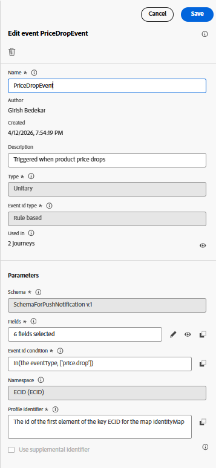

# Inviare messaggi push in un percorso

L’attivazione di un percorso basato su un evento di calo dei prezzi consente un coinvolgimento con gli utenti in tempo reale e basato su comportamenti. In scenari reali, questo evento in genere ha origine da un sistema di prezzi back-end quando il prezzo di un prodotto viene aggiornato. Questa esercitazione simula tale comportamento inviando un evento price.drop personalizzato tramite Adobe Data Layer tramite i tag di AEP, inclusi i dettagli del prodotto come nome e SKU. Questo evento viene acquisito in Adobe Experience Platform e utilizzato come trigger di ingresso per un percorso in Adobe Journey Optimizer. Una volta ricevuto, il percorso può inviare immediatamente una notifica push personalizzata agli utenti idonei, informandoli del calo dei prezzi e incoraggiando un’azione tempestiva.

La procedura seguente illustra come attivare un percorso utilizzando un evento personalizzato

## Creazione di un evento personalizzato in Journey Optimizer

Accedi a Adobe Journey Optimizer e passa ad Amministrazione → Configurazioni → Eventi, quindi seleziona Crea evento. Creare un nuovo evento denominato PriceDropEvent e associarlo allo schema dell&#39;evento SchemaForPushNotification creato in precedenza nell&#39;esercitazione. Assicurati che le proprietà dell’evento siano configurate come mostrato nell’immagine di riferimento.

Dallo schema, seleziona i campi richiesti per renderli disponibili per la personalizzazione. In particolare, includere `Name` e `SKU` dall&#39;oggetto ProductListItems, nonché l&#39;identificatore da identityMap. Questi campi saranno quindi accessibili all’interno dell’editor di personalizzazione, consentendoti di comporre dinamicamente i messaggi di notifica push in base al prodotto e al contesto dell’utente.

## Creazione della proprietà tag

Questa proprietà è configurata con AEP Web SDK, connesso al WebPushDataStream creato in precedenza nell&#39;esercitazione. La proprietà tag ascolta l’evento price.drop su Adobe Data Layer e mappa i dettagli dei prodotti pertinenti aggiornando l’elemento dati ProductListItems. Una volta preparati i dati, una regola nella proprietà tag si attiva e invia l’evento price.drop ad AEP tramite Web SDK. Questo evento funge quindi da punto di ingresso per un percorso in Adobe Journey Optimizer, consentendo la consegna immediata di notifiche push in base al calo di prezzo.

