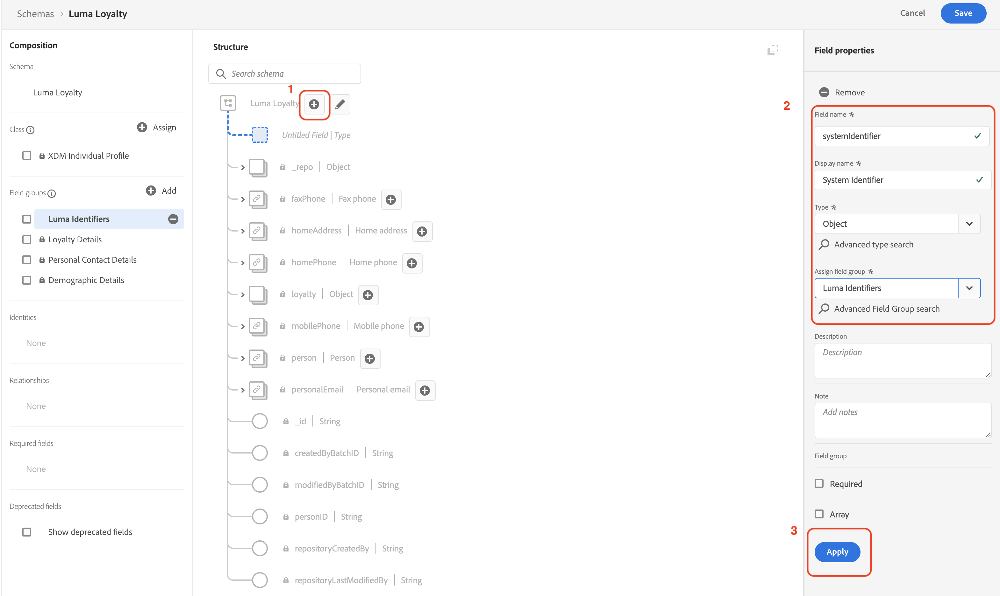
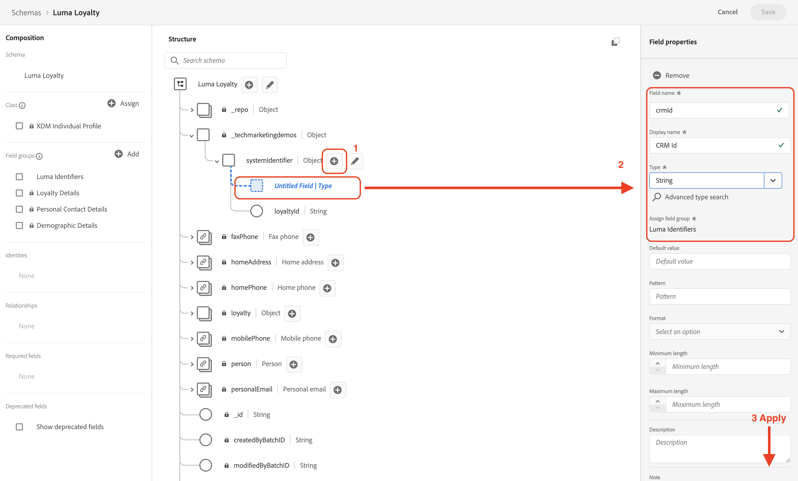

# Impostare i dati manualmente

In questa sezione puoi creare gli spazi dei nomi delle identità richiesti e definire la struttura per i dati di esempio [!DNL Luma] creando gli [[!UICONTROL schemi]](https://experienceleague.adobe.com/docs/experience-platform/xdm/schema/composition.html?lang=it).

>[!TIP]
>Prima di iniziare, guarda il video tutorial [Mappare le identità](/help/set-up-data/map-identities.md).

## Passaggio 1: creare gli spazi dei nomi delle identità

In questo passaggio verranno creati gli spazi dei nomi delle identità per i campi di identità personalizzati [!DNL Luma] denominati `lumaLoyaltyId`, `lumaCrmId` e `lumaProductSKU`. Gli spazi dei nomi delle identità svolgono un ruolo fondamentale nella creazione di profili cliente in tempo reale, in quanto due valori corrispondenti nello stesso spazio dei nomi consentono a due origini di dati di formare un grafo identità.

Per iniziare, crea uno [!UICONTROL spazio dei nomi] per lo schema [!DNL Luma Loyalty ID]:

1. Nell’interfaccia utente di Journey Optimizer, vai a **[!UICONTROL Cliente]** > **[!UICONTROL Identità]** nel menu di navigazione a sinistra.

1. Seleziona **[!UICONTROL Crea uno spazio dei nomi delle identità]**.

1. Fornisci le seguenti informazioni:

   | Nome visualizzato | Simbolo identità | Tipo |
   |---|---|---|
   | `Luma Loyalty ID` | `lumaLoyaltyId` | [!UICONTROL ID multi-dispositivo] |

1. Seleziona **[!UICONTROL Crea]**.

   

1. Crea altri due spazi dei nomi seguendo gli stessi passaggi:

   | Nome visualizzato | Simbolo identità | Tipo |
   |---|---|---|
   | `Luma CRM ID` | `lumaCrmId` | [!UICONTROL ID multi-dispositivo] |
   | `Luma Product SKU` | `lumaProductSKU` | [!UICONTROL Identificatore non personale] |

## Passaggio 2: creare gli schemi

In questo passaggio, puoi definire la struttura dei dati di esempio creando sei [[!UICONTROL schemi]](https://experienceleague.adobe.com/docs/experience-platform/xdm/schema/composition.html?lang=it):

* [[!DNL Luma Loyalty Schema]](#create-luma-loyalty-schema)

* [[!DNL Luma Product Catalog Schema]](#create-luma-product-catalog-schema)

* [Schema [!DNL Luma Product Inventory Events]](#create-luma-product-inventory-event-schema)

* [[!DNL Luma CRM Schema]](#create-luma-crm-and-luma-product-interactions-schemas)

* [[!DNL Luma Web Events Schema]](#create-luma-crm-and-luma-product-interactions-schemas)

* [[!DNL Luma Offline Purchase Events Schema]](#create-additional-schemas)

* [[!DNL Luma Test Profiles Schema]](#create-additional-schemas)

>[!TIP]
>
>Prima di iniziare, guarda il video tutorial: [Creare uno schema](/help/set-up-data/create-schema.md).

### Creare [!DNL Luma Loyalty Schema] {#create-luma-loyalty-schema}

Questa sezione descrive come creare lo schema [!DNL Luma Loyalty] e configurare i gruppi di campi.

#### Creare lo schema

1. Nel menu di navigazione a sinistra, passa a **[!UICONTROL GESTIONE DATI]** > **[!UICONTROL Schemi]**.

1. Seleziona **[!UICONTROL Crea schema]** in alto a destra.

1. Nel menu a discesa, seleziona **[!UICONTROL Profilo individuale XDM]**.

   È possibile selezionare questa opzione perché si stanno modellando gli attributi di un singolo cliente (punti, stato e così via).

#### Aggiungere gruppi di campi esistenti

Ti viene quindi richiesto di aggiungere gruppi di campi allo schema utilizzando i gruppi. Devi aggiungere gruppi di campi esistenti e creare un gruppo di campi.

1. Sulla pagina [!UICONTROL Schema], se la finestra modale Gruppi di campi non si è aperta automaticamente, seleziona **[!UICONTROL Aggiungi]**.

   

1. Sulla pagina **[!UICONTROL Aggiungi gruppi di campi]**, abilita i seguenti gruppi di campi:

   * **[!UICONTROL Dettagli demografici]** per dati di base del cliente come nome e data di nascita.

   * **[!UICONTROL Dettagli di contatto personali]** per dettagli di contatto di base come l’indirizzo e-mail e il numero di telefono.

   * **[!UICONTROL Dettagli fedeltà]** per dettagli sulla fedeltà come punti, data di iscrizione o stato. Il gruppo di campi fedeltà è molto in basso nell’elenco, quindi per trovarlo puoi usare la funzione di ricerca.

1. Seleziona **[!UICONTROL Aggiungi gruppo di campi]** per aggiungere tutti e tre i gruppi di campi allo schema.

   

1. Seleziona il nodo principale dello schema.

1. Inserisci `Luma Loyalty Schema` per **[!UICONTROL Nome visualizzato]**.

#### Creare un [!UICONTROL gruppo di campi] {#create-field-group}

Per garantire la coerenza tra gli schemi, Adobe consiglia di gestire tutti gli identificatori di sistema in un unico gruppo:

1. Dalla sezione **[!UICONTROL Composizione]** in [!UICONTROL Gruppi di campi], seleziona **[!UICONTROL Aggiungi]**.

1. Seleziona **[!UICONTROL Crea nuovo gruppo di campi]**.

1. Aggiungi `Luma Identity Profile Field Group` come **[!UICONTROL Nome visualizzato]**.

1. Aggiungi `system identifiers for XDM Individual Profile class` come **[!UICONTROL Descrizione]**.

1. Seleziona **[!UICONTROL Aggiungi gruppi di campi]**.

   

#### Aggiungi dei campi al nuovo [!UICONTROL gruppo di campi]

Il nuovo gruppo di campi vuoto viene aggiunto allo schema. Utilizzando i pulsanti + è possibile aggiungere nuovi campi in qualsiasi posizione nella gerarchia. In questo caso, devi aggiungere campi al livello principale:

1. Seleziona **[!UICONTROL +]** accanto al nome dello schema.

   Questo passaggio aggiunge un campo allo spazio dei nomi dell’**ID tenant** per gestire i conflitti tra i campi personalizzati e tutti i campi standard.

1. Nella barra laterale **[!UICONTROL Proprietà campo]**, aggiungi i dettagli del nuovo campo:

   * **Nome campo:** `systemIdentifier`

   * **[!UICONTROL Nome visualizzato]:** `System Identifier`

   * **Tipo:** oggetto

   * **[!UICONTROL Assegna gruppo di campi]:** [!DNL Luma identifiers]

1. Seleziona **[!UICONTROL Applica]**.

   

   Aggiungi due campi all’oggetto `systemIdentifier`:

   | [!UICONTROL Nomecampo] | [!UICONTROL Nome visualizzato] | [!UICONTROL Tipo] |
   |-------------|-----------|----------|
   | `loyaltyId` | `Loyalty Id` | [!UICONTROL Stringa] |
   | `crmId` | `CRM Id` | [!UICONTROL Stringa] |

#### Impostare le identità

Ora hai configurato lo [!UICONTROL spazio dei nomi] e il [!DNL Luma Loyalty schema]. Prima di poter acquisire i dati, devi etichettare i campi di identità. Ogni schema utilizzato con [!UICONTROL Profilo cliente in tempo reale] deve avere un’identità primaria specificata e ogni record acquisito deve avere un valore per quel campo.

1. Imposta l’**Identità primaria**:

   Dalla sezione **[!DNL Luma Loyalty Schema]**:

   1. Seleziona **[!DNL Luma Identity Profile Field Group]**.

   2. Seleziona il campo **[!DNL loyaltyId]**.

   3. In **[!UICONTROL Proprietà campo]**, abilita la casella **[!UICONTROL Identità]**.

   4. Abilita la casella **[!UICONTROL Identità primaria]**.

   5. Seleziona lo spazio dei nomi `Luma Loyalty Id` dal menu a discesa **[!UICONTROL Spazi dei nomi delle identità]**.

   6. Seleziona **[!UICONTROL Applica]**.

      

2. Imposta un’**identità secondaria**:

   Dalla sezione **[!DNL Luma Loyalty Schema]**:

   1. Seleziona **[!DNL Luma Identity Profile Field Group]**.

   2. Seleziona il campo `crmId`.

   3. In **[!UICONTROL Proprietà campo]**, abilita la casella **[!UICONTROL Identità]**.

   4. Seleziona lo spazio dei nomi `Luma CRM Id` dal menu a discesa **[!UICONTROL Spazi dei nomi delle identità]**.

   5. Seleziona **[!UICONTROL Applica]**.

#### Abilita per profilo e salva lo schema

1. Seleziona il nodo principale dello schema.

1. In [!UICONTROL Proprietà campo], abilita **[!UICONTROL Profilo]**.

   Lo schema deve essere simile al seguente:

   

1. Seleziona **[!UICONTROL Salva]**.

### Crea [!DNL Luma Product Catalog Schema] {#create-luma-product-catalog-schema}

1. Nel menu di navigazione a sinistra passa a **[!UICONTROL GESTIONE DATI]** > **[!UICONTROL Schemi]**.

1. Seleziona **[!UICONTROL Crea schema]** (in alto a destra).

1. Per creare una classe, seleziona **[!UICONTROL Sfoglia tutti i tipi di schema]** dal menu a discesa.

1. Seleziona **[!UICONTROL Crea nuova classe]**.

1. Aggiungi il nome visualizzato: `Luma Product Catalog Class`.

1. Assegna la classe.

1. Crea un [!UICONTROL Gruppo di campi]:

   * Nome visualizzato: `Luma Product Catalog Field Group`

1. Aggiungi il campo seguente a **[!DNL Luma Product Catalog Field Group]**.

   * Nome campo: `product`

   * Nome visualizzato: `Product`

   * Tipo: [!UICONTROL oggetto]

   * Gruppo di campi: [!DNL Luma Product Catalog Field Group]

1. Seleziona **[!UICONTROL Applica]**.

1. Aggiungi i seguenti campi all’oggetto **[!DNL Product]**:

   | [!UICONTROL Nomecampo] | [!UICONTROL Nome visualizzato] | [!UICONTROL Tipo] |
   |-------------|-----------|----------|
   | `sku` | `Product SKU` | [!UICONTROL Stringa] |
   | `name` | `Product Name` | [!UICONTROL Stringa] |
   | `category` | `Product Category` | [!UICONTROL Stringa] |
   | `color` | `Product Color` | [!UICONTROL Stringa] |
   | `size` | `Product Size` | [!UICONTROL Stringa] |
   | `price` | `Product Price` | [!UICONTROL Doppio] |
   | `description` | `Product Description` | [!UICONTROL Stringa] |
   | `imageURL` | `Product Image URL` | [!UICONTROL Stringa] |
   | `stockQuantity` | `Product Stock Quantity` | [!UICONTROL Stringa] |
   | `url` | `Product URL` | [!UICONTROL Stringa] |

1. Imposta **[!DNL SKU]** come identità primaria.
1. Aggiungi il **[!UICONTROL Nome visualizzato]** `Luma Product Catalog Field Group` al [!UICONTROL gruppo di campi].

1. Seleziona **[!UICONTROL Salva]**.

### Crea [!DNL Luma Product Inventory Event Schema] {#create-luma-product-inventory-event-schema}

1. Nel menu di navigazione a sinistra passa a **[!UICONTROL GESTIONE DATI]** > **[!UICONTROL Schemi]**.

1. Seleziona il pulsante **[!UICONTROL Crea schema]** in alto a destra.

1. Dal menu a discesa, seleziona **[!UICONTROL Sfoglia tutti i tipi di schema]**.

1. Seleziona **[!UICONTROL Crea nuova classe]**.

1. Aggiungi il nome visualizzato: `Luma Business Event Class`.

1. Seleziona il tipo: *[!UICONTROL Serie temporali]*.

1. Assegna la classe.

1. Crea un [!UICONTROL gruppo di campi]:

   * Nome visualizzato: `Luma Product Inventory Event Details Field Group`

1. Aggiungi il **[!UICONTROL Nome visualizzato]** `Luma Product Inventory Event Schema` allo schema.

1. Aggiungi il campo seguente a **[!DNL Luma Product Inventory Event Details Field Group]**:

   * Nome campo: `inventoryEvent`

   * Nome visualizzato: `Inventory Event`

   * Tipo: [!UICONTROL oggetto]

   * Gruppo di campi: `Luma Product Inventory Event Details Field Group`

1. Aggiungi i seguenti campi all’oggetto `Product Inventory Event Details`:

   | [!UICONTROL Nomecampo] | [!UICONTROL Nome visualizzato] | [!UICONTROL Tipo] |
   |-------------|-----------|----------|
   | `sku` | `SKU` | [!UICONTROL Stringa] |
   | `stockEventType` | `Stock Event Type` | [!UICONTROL Stringa] |

   1. per impostare `stockEventType` come enumerazione, seleziona il tipo: `string`.

   2. Scorri verso il basso fino alla parte inferiore delle **[!UICONTROL Proprietà campo]**.

   3. Abilita **[!UICONTROL Enumerazione]**.

   4. Inserisci i **[!UICONTROL valori] ([!UICONTROL etichetta)]**: `restock` (`Restock`).

   5. Seleziona **[!UICONTROL Aggiungi riga]**.

   6. Inserisci i **[!UICONTROL valori] ([!UICONTROL etichetta)]**: `outOfStock` (`Out of Stock`).

   7. Seleziona **[!UICONTROL Applica]**.

      

1. Imposta il campo `inventory.Event.sku` come **[!UICONTROL identità primaria]** utilizzando **[!DNL LumaProductSKU namespace]**.

1. Seleziona il campo `sku` e definisci una relazione con il campo `product.sku` nello schema **[!DNL Luma Product catalog Schema]**:

   1. Scorri verso il basso fino alla parte inferiore delle **[!UICONTROL Proprietà campo]**.

   2. Abilita **[!UICONTROL Relazione]**.

      1. **[!UICONTROL Schema di riferimento]**: [!DNL Luma Product Catalog Schema].

      2. **[!UICONTROL Spazio dei nomi delle identità di riferimento]**: [!DNL LumaProductSKU].
   3. Seleziona **[!UICONTROL Applica]**.

      Lo schema deve essere simile al seguente:

      

1. Abilita per **Profilo**.

1. Seleziona [!UICONTROL Salva] per salvare lo schema.

### Creare schemi aggiuntivi {#create-additional-schemas}

Crea i seguenti [!UICONTROL schemi] aggiuntivi:

| [!UICONTROL Nome visualizzato] | [!DNL Luma CRM Schema] | [!DNL Luma Web Events Schema] | [!DNL Luma Test Profiles schema] | [!DNL Luma Offline Purchase Events Schema] |
|  ---| ------- | ---- |----|----|
| **[!UICONTROL Classe]** | [!UICONTROL Profilo individuale XDM] | [!UICONTROL Evento esperienza XDM] | [!UICONTROL Profilo individuale XDM] | [IUICONTROL XDM ExperienceEvent] |
| **[!UICONTROL Aggiungere un gruppo di campi esistente]** | `Luma Identity Profile Field Group` `Demographic Details` `Personal Contact Details` | `Orchestration eventID` `Consumer Experience Event` `AEP Web SDK ExperienceEvent` | `Luma Identity Profile Field Group` `Demographic Details` `Personal Contact Details` `Profile test details` | `Luma Identity Profile Field Group`  `Commerce Details` |
| **[!UICONTROL Relazione]** |  | `productListItems.SKU`:  Schema di riferimento `Luma Product Catalog Schema`  [!DNL Reference identity namespace] `lumaProductSKU` |  | `productListItems.SKU`:  Schema di riferimento `Luma Product Catalog Schema`  [!DNL Reference identity namespace] `lumaProductSKU` |
| **[!UICONTROL Identità primaria] [!UICONTROL spazio dei nomi])** | `systemIdentifier.crmId` |  | `systemIdentifier.crmId` | `systemIdentifier.LoyaltyId` |
| **[!UICONTROL Abilita per il profilo]** | sì | sì | sì | sì |

## Passaggi successivi

Dopo aver creato la struttura dati, [crea set di dati e acquisisci dati di esempio](/help/tutorial-configure-a-training-sandbox/manual-data-ingestion.md).
