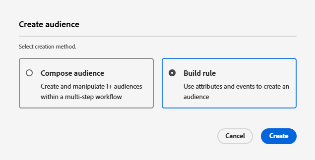

# Creazione di tipi di pubblico in Adobe Journey Optimizer

I tipi di pubblico in Adobe Experience Platform sono gruppi di utenti creati in base alle loro azioni, preferenze o informazioni di profilo, per fornire esperienze personalizzate.

* Accedi a Journey Optimizer
* Passa a Cliente -> Pubblico ->Crea pubblico
* Creare tipi di pubblico utilizzando il metodo Genera regola

  

* Crea i seguenti 3 tipi di pubblico

  * Clienti interessati alle scorte

  * Clienti interessati alle obbligazioni

  * Clienti interessati al CD

* Assicurati che il metodo di valutazione per ogni pubblico sia impostato su _&#x200B;**Edge**&#x200B;_ per la qualifica in tempo reale.
  

* Utilizzare il campo PreferredFinancialInstrument per segmentare gli utenti in base all&#39;interesse di investimento selezionato, ad esempio azioni, obbligazioni o CD

>[!NOTE]
>
>&#x200B;>Se il campo PreferredFinancialInstrument non è visibile nella scheda degli eventi, fai clic sull’icona delle impostazioni e attiva Mostra lo schema XDM completo.

