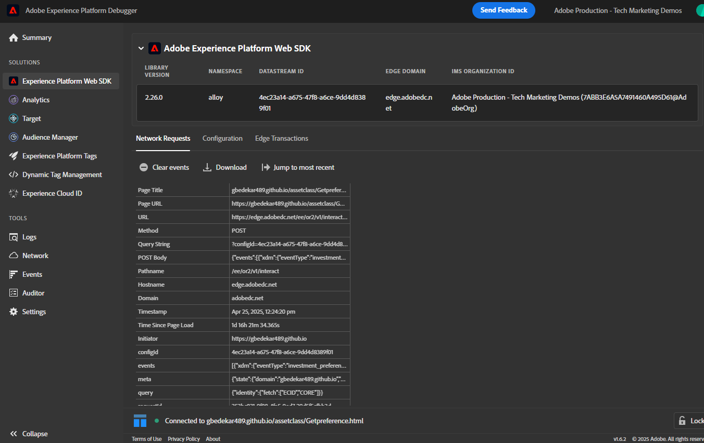

# Test della soluzione

Per convalidare l’implementazione, apri innanzitutto la pagina web contenente il modulo delle tue preferenze. Utilizza le schede DevTools (Console e Rete) del browser per monitorare il processo di invio dei moduli. Dopo aver inviato una preferenza (ad esempio, selezionando &quot;Stock&quot;), verifica che AEP Web SDK (alloy.sendEvent) sia stato attivato correttamente e che i dati corretti vengano inviati a Adobe Experience Platform. In AEP, accedi alla sezione Tipi di pubblico e verifica che il tuo profilo sia idoneo per il pubblico previsto (ad esempio, &quot;Interessato alle scorte&quot;) in pochi istanti, utilizzando la segmentazione di Edge. Puoi anche esaminare i dati dell’evento in arrivo nel set di dati associato per assicurarti che contengano il valore di preferenza corretto. Ripetere questo processo per ogni classe di risorse (Stock, Bonds, CD) per garantire il corretto funzionamento dell&#39;intero flusso di lavoro.

## Suggerimenti per la risoluzione dei problemi

Se non vedi immediatamente il profilo idoneo per il pubblico previsto, verifica quanto segue:

### Convalidare il push di Adobe Data Layer

* Apri la console → Strumenti per sviluppatori del browser
* Digita console.log(window.adobeDataLayer);
* Confermare che dopo l&#39;invio del modulo venga visualizzato un evento con evento &quot;assetClassSelection&quot; e il valore PreferredFinancialInstrument corretto

### Conferma esecuzione regola di Launch

* Apri Adobe Experience Platform Debugger (estensione Chrome)
* Accedi al debugger
* Inviare il modulo
* Verificare che l&#39;evento DataPush per assetClassSelection sia acquisito

La schermata seguente del debugger dovrebbe aiutarti

### Ottieni ECID

L’ECID (Experience Cloud ID) è l’identificatore univoco e costante di Adobe utilizzato per riconoscere e unificare gli utenti tra le soluzioni e le sessioni di Experience Cloud.

* Strumenti per sviluppatori di Chrome → scheda Rete

* Filtra per &quot;interagire&quot; o &quot;raccogliere&quot;

* Inviare il modulo
* Fai clic sulla scheda Risposta e annota l’ECID.

### Verifica la qualifica di profilo e pubblico in tempo reale

* Accedi a Journey Optimizer
* Vai a Clienti->Profili->Sfoglia
* Cerca ECID ottenuto dal passaggio precedente come mostrato nella schermata
  
* Fai clic sul profilo e seleziona la scheda eventi per verificare se è elencato investment_preferences_event
  
* Apri il json associato all’evento e verifica se contiene i dati dell’evento corretti.

### Ulteriori suggerimenti per la risoluzione dei problemi

* Assicurati che lo schema e il profilo del set di dati siano abilitati.
* Assicurati che la segmentazione di Edge sia abilitata per il pubblico in modo che la qualifica avvenga quasi in tempo reale.
* Può essere utile attendere alcuni minuti e aggiornare la visualizzazione Tipi di pubblico, soprattutto se si esegue il test subito dopo la pubblicazione delle modifiche.
* Assicurati che le regole del pubblico siano definite correttamente e facciano riferimento ai nomi e ai valori di campo esatti acquisiti dall’invio del modulo.
