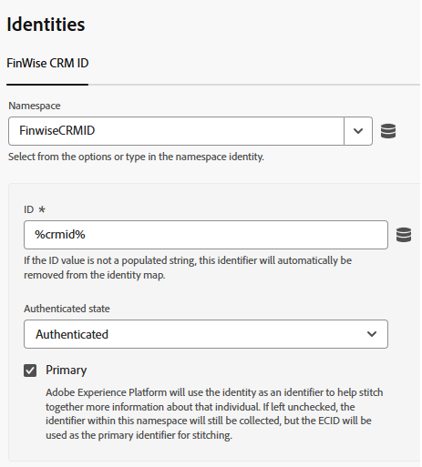
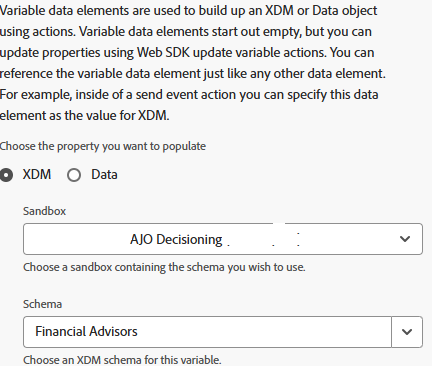
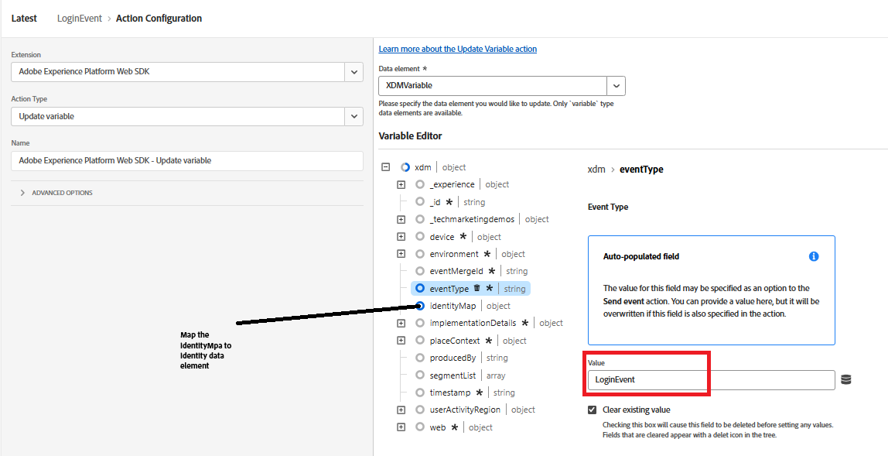

# Inviare CRMID a Adobe Experience Platform

I tag Adobe Experience Platform vengono utilizzati per inviare il CRMID a Adobe Experience Platform (AEP) perché fornisce un meccanismo flessibile e basato su eventi per la trasmissione dei dati di identità direttamente dal browser. L’invio di CRMID dopo l’accesso dell’utente consente ad AEP di collegare l’ECID anonimo al profilo di gestione delle relazioni con i clienti noto, consentendo un’unione precisa delle identità. Questo collegamento costituisce la base per la creazione di profili cliente unificati, la qualificazione dei tipi di pubblico e la distribuzione di esperienze personalizzate in tempo reale in Adobe Journey Optimizer (AJO).

È stata creata una proprietà Experience Platform Tags denominata _**FinWise**_. Le seguenti estensioni sono state aggiunte alla proprietà Tags

Configura l&#39;estensione AEP Web SDK utilizzando il flusso di dati Financial Advisors creato nel passaggio precedente.
Il servizio Experience Cloud ID è un’estensione opzionale aggiunta alla proprietà tag a scopo di debug.

## Tag elementi dati

Crea i seguenti elementi dati

| Elemento dati | Estensione | Tipo di elemento dati | Impostazioni personalizzate |
|--------------|-----------------------------------|---------------------------|----------------------------------------|
| crmid | Adobe Client Data Layer | Stato calcolato del livello dati | user.crmid |
| ECID | Servizio Experience Cloud ID | ECID |                                        |
| identità | Adobe Experience Platform Web SDK | Mappa identità |  |
| Variabile XDMV | Adobe Experience Platform Web SDK | Variable |  |

## Crea regola

Crea una regola denominata LoginEvent con l&#39;evento e le azioni seguenti

Evento

Azione Aggiorna variabile

Azione Invia evento

## Salva e genera

Salva le modifiche, crea e genera la libreria.
