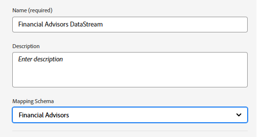

# Configurare schema XDM, set di dati e stream di dati in AEP

## Crea schema XDM

Per utilizzare Adobe Experience Platform Web SDK (Alloy.js) in una pagina web, i tag di AEP devono essere associati a uno stream di dati mappato a uno schema evento XDM. Il Web SDK (alloy.sendEvent) invia dati ad AEP come eventi esperienza, che devono essere conformi a uno schema XDM basato sulla classe XDM ExperienceEvent.

Per creare uno schema XDM

* Accedi a Adobe Experience Platform
* Gestione dati -> Schemi -> Crea schema

* Creare uno schema basato su eventi XDM denominato **_Financial Advisors_**. Se non sai creare uno schema, segui questa [documentazione](https://experienceleague.adobe.com/it/docs/experience-platform/xdm/tutorials/create-schema-ui)

* Assicurati che lo schema sia abilitato per il profilo.

## Creare un set di dati basato sullo schema

Un **set di dati in Adobe Experience Platform (AEP)** è un contenitore di archiviazione strutturato utilizzato per acquisire, archiviare e attivare dati in base a uno schema XDM definito.

* Gestione dati -> Set di dati -> Crea set di dati
* Creare un set di dati denominato **_Set di dati di Financial Advisors_** in base allo schema XDM (Financial Advisors) creato nel passaggio precedente.

* Assicurati che il set di dati sia abilitato per il profilo

## Creare uno stream di dati

Un flusso di dati in Adobe Experience Platform è simile a una pipeline (o autostrada) sicura che connette il sito web o l’app ai servizi Adobe, consentendo il flusso dei dati e la reintroduzione di contenuti personalizzati.

* Passa a Raccolta dati > Flussi dati, quindi fai clic su Nuovo flusso dati. Denomina lo stream di dati **_Flusso di dati di Financial Advisors_**

* Fornisci i seguenti dettagli come mostrato nella schermata seguente
  
* Fai clic su Salva, quindi su Aggiungi mappatura e aggiungi il servizio Adobe Experience Platform e il set di dati dell’evento come mostrato
  

* Scegli il set di dati evento appropriato (creato in precedenza).

* Salva lo stream di dati.
