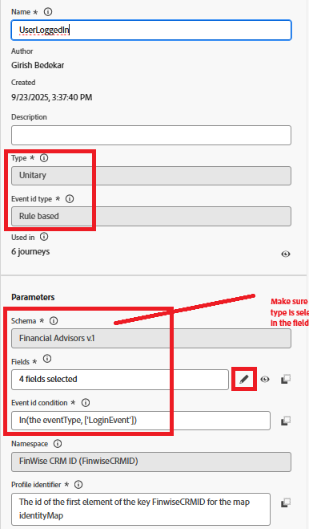

# Attivare il Percorso Adobe Journey Optimizer tramite Adobe Web SDK

In questa estensione del tutorial Unione identità, viene attivato il percorso Adobe Journey Optimizer che invia un’e-mail all’utente connesso utilizzando il suo profilo unito. **In questo articolo si presuppone che tu abbia familiarità con il canale di posta elettronica e che tu abbia creato contenuti per il canale di posta elettronica.**

## Crea configurazione canale di posta elettronica

* Accedi a _**Journey Optimizer**_
* Passa a _**Amministrazione -> Canali -> Crea configurazione canale**_
* Seleziona **E-mail** dall&#39;elenco dei canali. Fornisci un nome e una descrizione significativi.
* Inserisci le impostazioni e-mail.
* Fornisci i dettagli di esecuzione come mostrato di seguito. L’e-mail viene inviata all’indirizzo e-mail del profilo memorizzato nel campo
* 
* Attivare la configurazione del canale e-mail

## Crea evento

* Accedi a _**Journey Optimizer**_
* Passa a _**Amministrazione -> Configurazioni**_
* Fai clic sul pulsante Gestisci nella scheda Eventi e fai clic su Crea evento. Specificate i valori come mostrato di seguito
* 

* Verifica se il tipo di evento dell’evento è uguale a LoginEvent. Il tipo `LoginEvent` è impostato nel tag Adobe Experience Platform.
* Salvare l’evento

## Crea percorso

* Accedi a _**Journey Optimizer**_
* Passa a _**Gestione Percorsi -> Percorsi -> Crea Percorso**_
* Trascina e rilascia l&#39;evento _**UserLoggedIn**_ nell&#39;area di lavoro
* Trascina e rilascia E-mail dal menu Azioni. Configura l’azione e-mail in modo che utilizzi la configurazione del canale e-mail creata in precedenza.
* Pubblica il percorso.

## Modalità di attivazione del percorso

Il percorso viene attivato quando il payload dell’evento inviato tramite Web SDK corrisponde a quanto configurato nel percorso. In questo esempio, il tipo di evento `UserLoggedIn` è `LoginEvent`.

* Verifica visualizzando il rapporto sul percorso
* 

