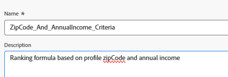

# Crea formula di classificazione

Durante le decisioni sulle offerte viene utilizzata una formula di classificazione in Adobe Journey Optimizer, in particolare all’interno di una strategia di selezione per determinare l’ordine di priorità delle offerte idonee. La formula di classificazione entra in gioco dopo il filtro di idoneità, quando più offerte sono idonee per un determinato profilo, ma solo la prima (o poche) devono essere presentate in base alla logica di business o al contesto del profilo.

* Accedi a Journey Optimizer

* Decisioning ->Impostazione strategia ->Formule di classificazione ->Crea formula

Formula di classificazione


Un criterio in una formula di classificazione si riferisce a una regola condizionale utilizzata per assegnare un punteggio a un’offerta. Questi criteri confrontano gli attributi dell’offerta con il profilo o il contesto per determinare la rilevanza di un’offerta per un individuo specifico.


Criterio 1

Questa condizione filtra gli elementi decisionali (offerte) **per includere solo** le offerte con tag &quot;IncomeLevel&quot;.
Queste offerte filtrate procederanno quindi al passaggio successivo, ad esempio la classificazione o la consegna, in base alla logica aggiuntiva definita dall’utente.


L’espressione seguente viene utilizzata per creare il punteggio di classificazione

```pql
if(   offer._techmarketingdemos.offerDetails.zipCode = _techmarketingdemos.zipCode,   _techmarketingdemos.annualIncome / 1000 + 10000,   if(     not offer._techmarketingdemos.offerDetails.zipCode,     _techmarketingdemos.annualIncome / 1000,     -9999   ) )
```

Funzionamento della formula

* Se l’offerta ha lo stesso codice postale dell’utente, assegnagli un punteggio molto alto in modo che venga selezionata per prima.

* Se l’offerta non ha alcun codice postale (si tratta di un’offerta generale), assegnale un punteggio normale in base al reddito dell’utente.

* Se l’offerta ha un codice postale diverso da quello dell’utente, assegna un punteggio molto basso in modo che non sia selezionata.

In questo modo, il sistema:

* Tenta sempre di mostrare prima un’offerta con corrispondenza ZIP,

* Torna a un’offerta generale se non viene trovata alcuna corrispondenza ed evita di mostrare offerte destinate ad altri codici postali.


Se un elemento dell’offerta non soddisfa nessuno dei criteri di filtro (ad esempio non dispone del tag &quot;IncomeLevel&quot;), l’offerta riceve un punteggio di classificazione predefinito di 10.


