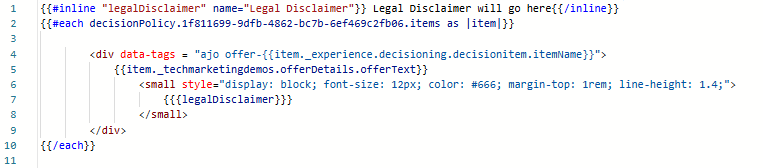

# Utilizzo di campi modulo modificabili nelle esperienze basate su codice di AJO

In molti percorsi di marketing, in particolare nelle industrie regolamentate, è essenziale includere una dichiarazione di non responsabilità legale che possa variare a seconda della campagna, della posizione geografica o del prodotto. Utilizzando un campo [modificabile](https://experienceleague.adobe.com/it/docs/journey-optimizer-learn/tutorials/channels/code-based-experience-channel/form-fields-in-code-based-experiences) direttamente nell&#39;editor di AJO Personalization, gli addetti al marketing e i team legali possono mantenere il controllo completo sul testo della liberatoria senza coinvolgere gli sviluppatori o modificare la logica decisionale.

Questo consente aggiornamenti rapidi e garantisce la conformità in tutte le campagne, sfruttando al contempo contenuti decisi come le offerte.

## Inserire un campo modificabile nell’editor di personalizzazione

- Apri la campagna creata nel passaggio precedente.
- Fai clic su _&#x200B;**Modifica campagna**&#x200B;_
- Passa alla scheda _&#x200B;**Contenuto**&#x200B;_
- Fai clic su _&#x200B;**Modifica codice**&#x200B;_ e inserisci un campo modificabile denominato legalDisclaimer con un valore predefinito utilizzando la seguente sintassi nell&#39;editor di personalizzazione

- &#x200B;
  <pre><code>&#123;&#123;#inline &quot;legalDisclaimer&quot; name=&quot;Legal Disclaimer&quot;&#125;&#125; Legal Disclaimer will go here &#123;&#123;/inline&#125;&#125;</code></pre>

- Utilizza <code>{{{legalDisclaimer}}}</code> nel modello, come illustrato di seguito

- 

- Gli addetti al marketing possono modificare facilmente il campo Dichiarazione di non responsabilità legale senza dover aprire l’editor di personalizzazione.
- 

## Pubblica la campagna

Attiva la campagna per iniziare a consegnare offerte personalizzate in tempo reale.
