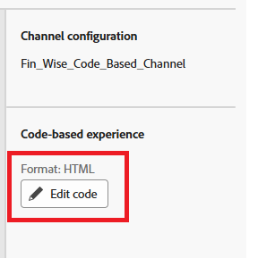

# Creare una campagna

In Adobe Journey Optimizer (AJO), una campagna funge da contenitore che riunisce tutti gli elementi necessari per fornire esperienze personalizzate a un pubblico mirato. Orcheggia quando e come vengono presentate le offerte, collegando componenti come canali, posizionamenti, raccolte e strategie decisionali.

1. Accedi a Journey Optimizer.
1. Fai clic su **[!UICONTROL Gestione Percorsi]** > **[!UICONTROL Campagne]** > **[!UICONTROL Crea campagna]** > **[!UICONTROL Pianifica marketing]**.
1. Fornisci un nome significativo alla campagna
1. Passa alla scheda _**Azione**_
1. Seleziona l&#39;azione **[!UICONTROL Esperienza basata su codice]**, quindi seleziona la configurazione creata nel passaggio precedente.
1. Fare clic su **[!UICONTROL Modifica contenuto]**.

   

1. Per aprire l&#39;editor di personalizzazione, fare clic su **[!UICONTROL Modifica codice]**.

   

   L’editor di personalizzazione è un’interfaccia non visiva per la creazione di esperienze che consente di creare il codice.
